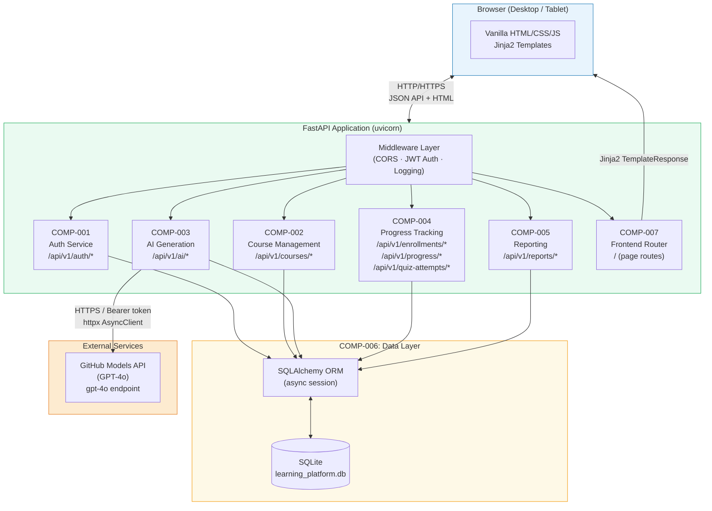
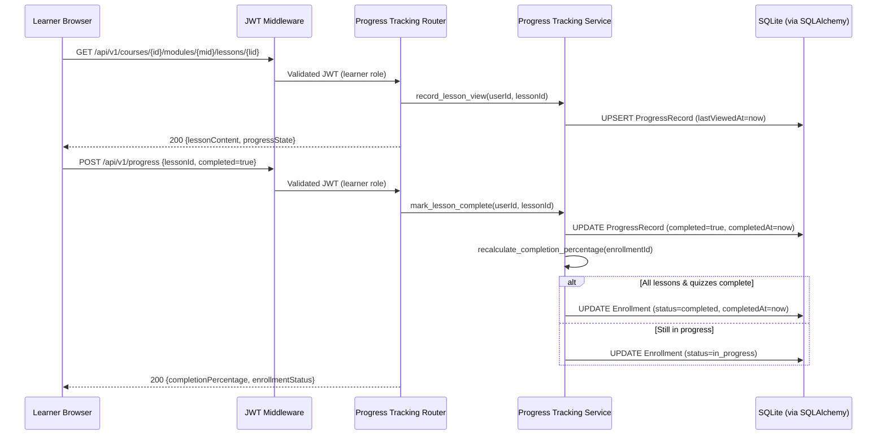
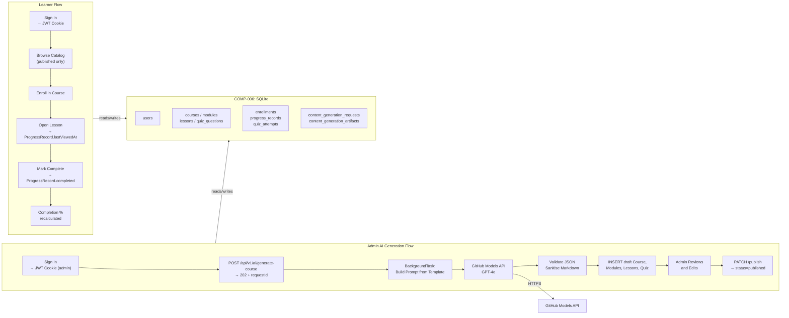

# High-Level Design (HLD)

| Field              | Value                                                          |
|--------------------|----------------------------------------------------------------|
| **Title**          | Learning Platform MVP — High-Level Design                      |
| **Version**        | 1.0                                                            |
| **Date**           | 2026-03-26                                                     |
| **Author**         | 2-plan-and-design-agent                                        |
| **BRD Reference**  | `docs/requirements/BRD.md` v1.0                                |

---

## 1. Design Overview & Goals

### 1.1 Purpose

This High-Level Design describes the complete system architecture of the **Learning Platform MVP** — an AI-assisted internal training application built on Python 3.11 / FastAPI with a SQLite database and a Vanilla HTML/CSS/JS + Jinja2 frontend. The platform enables Learners to enroll in and complete GitHub-focused courses while Admins create, manage, and publish content using the GitHub Models API (GPT-4o) for AI-assisted draft generation.

The HLD covers seven logical components (COMP-001 through COMP-007), their interactions, the data flow from user request through AI generation to rendered output, security boundaries, and the deployment model. It is the primary input to the Low-Level Design documents and the backlog-decomposition process.

### 1.2 Design Goals

- **Simplicity first**: Keep the architecture suitable for a single-developer MVP. Avoid distributed services, message queues, or cloud infrastructure; the platform must run locally with a single `uvicorn` process.
- **Clean service separation**: Organise backend logic into five clearly bounded service modules (Auth, Course Management, AI Generation, Progress Tracking, Reporting) with no cross-service direct database access — each service owns its own database operations.
- **Graceful AI decoupling**: Published course consumption must remain fully functional when the GitHub Models API is unavailable. AI generation failures are isolated to the generation workflow and do not cascade to learner-facing features.
- **Content governance by design**: No AI-generated content is ever visible to learners without an explicit admin publish action. The draft → review → publish workflow is enforced at the service layer, not just the UI.
- **MCP-ready architecture**: The AI generation service is structured with separated layers (prompt orchestration, model invocation, content persistence, review workflow) so a future MCP server can wrap the model invocation layer without refactoring.
- **Security by default**: RBAC enforced on all endpoints, secrets in environment variables, XSS-sanitised Markdown rendering, HTTP-only JWT cookies, and scoped CORS policy.
- **Extensibility without complexity**: Adding a new course topic, prompt template, or report metric requires no architectural change — only data and configuration changes.

### 1.3 Design Constraints

- **Fixed tech stack**: Python 3.11+, FastAPI, Pydantic v2, SQLite, Jinja2 + Vanilla JS, pytest + httpx — no deviations permitted for MVP.
- **Single AI provider**: GitHub Models API (GPT-4o) only. No fallback model provider in MVP; resilience is achieved through retry-and-fail, not model substitution.
- **SQLite only**: No high-concurrency write workloads; supports up to 50 concurrent learners per BRD-NFR-003. Migration to PostgreSQL is a documented future enhancement.
- **Single-process deployment**: No worker processes, task queues (Celery, RQ), or async brokers. AI generation uses FastAPI's `BackgroundTasks` for non-blocking async within the single process.
- **No frontend framework**: Vanilla HTML/CSS/JS with Jinja2 server-side rendering. No React, Vue, Angular, or similar.
- **Secrets via environment variables only**: All credentials and configuration loaded via `pydantic-settings`; never hardcoded.
- **No SSO/OAuth in MVP**: Platform-native email/password authentication with JWT tokens stored in HTTP-only cookies.

---

## 2. Architecture Diagram



---

## 3. System Components

| Component ID | Name                      | Description                                                                                                                                                       | Technology                                          | BRD Requirements                                                                                  |
|--------------|---------------------------|-------------------------------------------------------------------------------------------------------------------------------------------------------------------|-----------------------------------------------------|---------------------------------------------------------------------------------------------------|
| COMP-001     | Auth Service              | Handles user sign-in and sign-out, issues JWT tokens stored in HTTP-only cookies, and enforces RBAC via FastAPI dependency injection on all protected routes.     | FastAPI, python-jose, passlib, pydantic-settings    | BRD-FR-001, BRD-FR-002, BRD-FR-003, BRD-FR-004, BRD-NFR-004, BRD-NFR-005                        |
| COMP-002     | Course Management Service | Provides CRUD operations for Courses, Modules, Lessons, and QuizQuestions. Manages the draft/published status lifecycle, catalog filtering, and course seeding.   | FastAPI, SQLAlchemy, Pydantic v2, bleach (sanitise) | BRD-FR-005 through BRD-FR-013, BRD-FR-037 through BRD-FR-044, BRD-NFR-001, BRD-NFR-006          |
| COMP-003     | AI Generation Service     | Integrates with the GitHub Models API (GPT-4o) to generate structured course drafts. Manages prompt templates, retry logic, generation status tracking, and the draft content audit trail. | FastAPI BackgroundTasks, httpx AsyncClient, Pydantic v2 | BRD-FR-029 through BRD-FR-037, BRD-INT-001 through BRD-INT-010, BRD-NFR-002, BRD-NFR-011, BRD-NFR-012 |
| COMP-004     | Progress Tracking Service | Manages Enrollments, ProgressRecords, and QuizAttempts. Calculates completion percentages, handles quiz scoring, and transitions enrollment status automatically. | FastAPI, SQLAlchemy, Pydantic v2                    | BRD-FR-014 through BRD-FR-025, BRD-NFR-010                                                       |
| COMP-005     | Reporting Service         | Provides aggregated admin dashboard metrics (enrollment counts, completion rates, quiz summaries) and CSV export of learner progress data.                        | FastAPI, SQLAlchemy, Python csv module              | BRD-FR-026, BRD-FR-027, BRD-FR-028, BRD-NFR-013, BRD-NFR-014, BRD-NFR-015                       |
| COMP-006     | Data Layer                | SQLite database managed via SQLAlchemy ORM. Owns all table schemas, migrations (Alembic), session lifecycle, and the database seed script for starter courses.    | SQLite, SQLAlchemy 2.x (async), Alembic            | BRD-FR-041, BRD-FR-042, BRD-FR-043, BRD-FR-044, BRD-NFR-003                                     |
| COMP-007     | Frontend                  | Serves Jinja2 HTML templates at root page routes for the learner dashboard, course viewer, admin editor, and reporting UI. Vanilla JS handles dynamic interactions (progress polling, quiz submission, generation status polling). | Jinja2, Vanilla HTML/CSS/JS                        | BRD-NFR-008, BRD-NFR-009, BRD-FR-033, BRD-FR-035                                                |

---

## 4. Component Interactions

### 4.1 Communication Patterns

| Pattern                          | Participants                              | Description                                                                                                                                                                          |
|----------------------------------|-------------------------------------------|--------------------------------------------------------------------------------------------------------------------------------------------------------------------------------------|
| HTTP REST (browser → backend)    | Browser ↔ COMP-001 through COMP-005       | All API calls from the browser use JSON over HTTP. The browser sends JWT credentials in HTTP-only cookies set by COMP-001 on sign-in. API responses follow a consistent JSON envelope. |
| Jinja2 server-side rendering     | COMP-007 → Browser                        | Page routes (e.g., `/`, `/courses`, `/admin`) return full HTML via `Jinja2TemplateResponse`. Initial page data is embedded in the template; subsequent data fetched via JSON API.     |
| Direct function call (in-process)| Service → COMP-006                        | Service modules call SQLAlchemy sessions directly (no HTTP hop). Each service receives an `AsyncSession` via FastAPI `Depends()` injection.                                          |
| HTTPS (backend → GitHub Models)  | COMP-003 → GitHub Models API              | httpx `AsyncClient` sends POST requests to the configured `GITHUB_MODELS_ENDPOINT` with a Bearer token. Timeouts set to 60 s; exponential backoff on 429/5xx.                       |
| Background task (in-process)     | COMP-003 internal                         | AI generation is dispatched via `fastapi.BackgroundTasks` so the initial `POST /api/v1/ai/generate-course` returns 202 immediately while generation runs asynchronously.             |
| JWT middleware (cross-cutting)   | Middleware → All protected routes         | A custom FastAPI middleware extracts and validates the JWT from the HTTP-only cookie on every request. The decoded user identity is injected into the request state for RBAC checks.  |

### 4.2 Interaction Diagram — AI Course Generation Flow

```mermaid
sequenceDiagram
    participant Admin as Admin Browser
    participant MW as JWT Middleware
    participant AIRouter as AI Generation Router
    participant AISvc as AI Generation Service
    participant GHModels as GitHub Models API
    participant DB as SQLite (via SQLAlchemy)

    Admin->>MW: POST /api/v1/ai/generate-course {topic, audience, objectives, difficulty}
    MW->>AIRouter: Validated JWT (admin role confirmed)
    AIRouter->>AISvc: generate_course_async(request_data)
    AISvc->>DB: INSERT ContentGenerationRequest (status=pending)
    AIRouter-->>Admin: 202 Accepted {generationRequestId}

    Note over AISvc,GHModels: BackgroundTask executes asynchronously
    AISvc->>DB: UPDATE ContentGenerationRequest (status=in_progress)
    AISvc->>GHModels: POST /chat/completions {prompt, model=gpt-4o}
    alt Success
        GHModels-->>AISvc: 200 {structured JSON content}
        AISvc->>AISvc: Validate JSON with Pydantic; sanitise Markdown via bleach
        AISvc->>DB: INSERT Course, Modules, Lessons, QuizQuestions (status=draft)
        AISvc->>DB: INSERT ContentGenerationArtifact
        AISvc->>DB: UPDATE ContentGenerationRequest (status=completed, latencyMs)
    else Rate Limited (429)
        GHModels-->>AISvc: 429 Too Many Requests
        AISvc->>AISvc: Exponential backoff (max 3 retries)
        AISvc->>DB: UPDATE ContentGenerationRequest (status=failed, errorMessage)
    else Timeout / 5xx
        GHModels-->>AISvc: Timeout or 5xx Error
        AISvc->>DB: UPDATE ContentGenerationRequest (status=failed, errorMessage)
    end

    Admin->>MW: GET /api/v1/ai/requests/{id}
    MW->>AIRouter: Validated JWT
    AIRouter->>DB: SELECT ContentGenerationRequest
    AIRouter-->>Admin: {status, courseId, errorMessage}
```

### 4.3 Interaction Diagram — Learner Lesson Completion Flow



---

## 5. Data Flow Overview

### 5.1 Primary Data Flows

**Flow 1 — Learner Course Consumption**
A Learner signs in → JWT issued as HTTP-only cookie → Learner views course catalog (only published courses returned) → Enrolls in course → Opens lesson (ProgressRecord written with `lastViewedAt`) → Marks lesson complete → System recalculates completion percentage → Enrollment transitions to `completed` when all lessons/quizzes are done.

**Flow 2 — Admin AI-Assisted Course Creation**
Admin signs in → Submits generation request (topic, audience, objectives, difficulty) → `ContentGenerationRequest` created in DB (status=`pending`) → 202 returned immediately → Background task constructs prompt using template, calls GitHub Models API → JSON response validated against Pydantic schema → Markdown sanitised via bleach → Course/Modules/Lessons/QuizQuestions inserted as `draft` → `ContentGenerationArtifact` inserted → Admin polls status endpoint → Admin reviews and edits content → Admin publishes → `status` set to `published` → Content appears in learner catalog.

**Flow 3 — Admin Reporting**
Admin navigates to dashboard → Reporting Service queries DB for aggregated enrollment counts, completion rates, quiz score summaries → Results returned as JSON → Admin optionally exports filtered data as CSV.

### 5.2 Data Flow Diagram



---

## 6. GitHub Models API Integration Design

### 6.1 Integration Approach

The AI generation service (COMP-003) is the sole component that communicates with the GitHub Models API. It is structured as four separated, independently testable layers:

1. **Prompt Orchestration Layer** (`prompt_service.py`): Selects and renders the appropriate prompt template given the generation context (topic, audience, objectives, difficulty, desired module count). Stores five reusable templates as application-level configuration (see BRD-INT-007).

2. **Model Invocation Layer** (`model_client.py`): A thin async wrapper around `httpx.AsyncClient` that calls the GitHub Models endpoint. Handles retry logic (exponential backoff on 429/5xx, configurable max retries) and timeout enforcement (60 s per BRD-INT-005). This layer is the intended future MCP tool exposure point.

3. **Content Persistence Layer** (`content_service.py`): Validates the JSON response against Pydantic schemas, sanitises all Markdown content via `bleach`, and persists Course/Module/Lesson/QuizQuestion records with `status=draft` and `isAiGenerated=true`.

4. **Review Workflow Layer** (`review_router.py`): Provides admin-facing endpoints for inspecting draft artifacts, approving/editing sections, and triggering publish. Enforces the mandatory review step before any content becomes visible to learners.

### 6.2 API Usage Patterns

| Pattern                      | Description                                                                                                        | Endpoint / Model                            |
|------------------------------|--------------------------------------------------------------------------------------------------------------------|---------------------------------------------|
| Full Course Generation       | Generates a complete course: title, description, modules, lessons, quiz questions, and key takeaways in one call.  | `GITHUB_MODELS_ENDPOINT` / `gpt-4o`         |
| Section Regeneration         | Regenerates a single module, lesson, or quiz section using a targeted prompt scoped to that section's context.     | `GITHUB_MODELS_ENDPOINT` / `gpt-4o`         |
| Module Summary Generation    | Generates a summary paragraph for a module from its lesson content (Summarise Module template).                    | `GITHUB_MODELS_ENDPOINT` / `gpt-4o`         |
| Skill-Level Rewrite          | Rewrites an existing lesson for a different difficulty level (Rewrite for Different Skill Level template).          | `GITHUB_MODELS_ENDPOINT` / `gpt-4o`         |
| Quiz Question Generation     | Generates multiple-choice quiz questions for a module, including correct answer and explanations.                  | `GITHUB_MODELS_ENDPOINT` / `gpt-4o`         |

### 6.3 Prompt Management

Five prompt templates are stored as application-level configuration constants in `src/ai_generation/prompt_templates.py`. Each template uses Python f-string placeholders for dynamic context (topic, audience, objectives, difficulty):

| Template ID | Name                              | Description                                                                      |
|-------------|-----------------------------------|----------------------------------------------------------------------------------|
| PT-001      | Generate Course Outline           | Instructs GPT-4o to return a JSON course structure with modules and lesson titles |
| PT-002      | Generate Lesson Content           | Generates full Markdown content for a named lesson within a given module context  |
| PT-003      | Generate Quiz Questions           | Generates 3–5 multiple-choice questions with options, correct answer, explanation |
| PT-004      | Summarise Module                  | Produces a 2–3 sentence summary of a module given its lesson content              |
| PT-005      | Rewrite for Different Skill Level | Rewrites existing lesson Markdown for a specified difficulty level               |

All prompts include an explicit instruction to return **valid JSON** conforming to the defined content schema (BRD-INT-006). The template ID used is recorded in every `ContentGenerationRequest` for audit traceability.

### 6.4 Error Handling & Resilience

| Scenario                     | Handling                                                                                                       |
|------------------------------|----------------------------------------------------------------------------------------------------------------|
| HTTP 429 (Rate Limited)      | Exponential backoff: wait 1 s, 2 s, 4 s (3 retries max). After max retries, set `ContentGenerationRequest.status = failed`. |
| HTTP 5xx from GitHub Models  | Same retry strategy as 429. Log full error internally; surface sanitised message to admin UI.                  |
| Request Timeout (> 60 s)     | httpx `TimeoutException` caught; set status = `failed`; no retry on pure timeout (admin retries manually).     |
| Invalid JSON Response        | Pydantic `ValidationError` caught; raw response logged at DEBUG; set status = `failed` with descriptive error.  |
| Missing API Key              | `pydantic-settings` raises `ValidationError` at startup before any request is served.                          |
| AI Service Down              | Published course catalog and lesson delivery unaffected (served from SQLite). Admin sees clear error on generation attempt. |

---

## 7. Technology Stack

| Layer            | Technology                   | Version / Notes                        | Rationale                                                                                          |
|------------------|------------------------------|----------------------------------------|----------------------------------------------------------------------------------------------------|
| Language         | Python                       | 3.11+                                  | Required by constraints. Type hints, `asyncio`, and `match` statements improve code clarity.        |
| Web Framework    | FastAPI                      | 0.111+                                 | High-performance async ASGI framework with built-in Pydantic integration, OpenAPI docs, and `Depends()` DI. |
| ASGI Server      | Uvicorn                      | 0.29+                                  | Lightweight ASGI server; single-process adequate for MVP concurrency requirements.                  |
| Data Models      | Pydantic v2                  | 2.x                                    | Required by constraints. Strict validation, JSON serialisation, and `pydantic-settings` for config. |
| Database         | SQLite                       | 3.x (bundled with Python)              | Zero-configuration, file-based; adequate for MVP (≤ 50 concurrent learners per BRD-NFR-003).       |
| ORM              | SQLAlchemy                   | 2.x (async)                            | Mature Python ORM; async session support pairs naturally with FastAPI; clear migration path to PostgreSQL. |
| Migrations       | Alembic                      | 1.x                                    | Standard SQLAlchemy migration tool; tracks schema changes; supports seed scripts.                   |
| AI Integration   | httpx                        | 0.27+                                  | Async HTTP client; used for GitHub Models API calls; supports timeout and retry configuration.      |
| Content Security | bleach                       | 6.x                                    | Battle-tested HTML/Markdown sanitiser; strips XSS vectors from rendered Markdown (BRD-NFR-006).    |
| Auth / JWT       | python-jose                  | 3.x                                    | JWT encode/decode; HMAC-SHA256 signing; lightweight and well-maintained.                            |
| Password Hashing | passlib (bcrypt)             | 1.7+                                   | Secure password hashing; bcrypt algorithm; `CryptContext` API integrates cleanly with FastAPI.      |
| Frontend         | Jinja2                       | 3.x                                    | Required by constraints. Server-side HTML rendering; integrates natively with FastAPI via `Jinja2Templates`. |
| Frontend JS      | Vanilla JS                   | ES2020+                                | Required by constraints. No frontend framework; fetch API for JSON calls; minimal complexity.       |
| Testing          | pytest + httpx AsyncClient   | pytest 8.x, httpx 0.27+               | Required by constraints. `httpx.AsyncClient` for integration tests; `respx` for mocking GitHub Models calls. |
| Settings         | pydantic-settings            | 2.x                                    | Required by constraints. Type-safe environment variable loading; validates required secrets at startup. |
| Package Manager  | pip / uv                     | uv 0.4+                                | `uv` for fast dependency resolution and virtual environment management in CI.                       |

---

## 8. Deployment Architecture

### 8.1 MVP / Local Development

The platform runs as a single `uvicorn` process on the developer's machine. SQLite stores data in a local file (`learning_platform.db`). The only outbound network dependency is HTTPS calls to the GitHub Models API.

```
Developer Machine
├── Python 3.11+ virtual environment (.venv)
│   ├── FastAPI + Uvicorn (ASGI server, port 8000)
│   ├── SQLAlchemy ORM + Alembic (SQLite driver: aiosqlite)
│   ├── Jinja2 (server-rendered HTML at root paths)
│   └── httpx AsyncClient (outbound HTTPS to GitHub Models)
├── Environment variables (.env file, never committed)
│   ├── GITHUB_MODELS_API_KEY=<secret>
│   ├── GITHUB_MODELS_ENDPOINT=https://models.inference.ai.azure.com
│   ├── SECRET_KEY=<jwt-signing-secret>
│   ├── DATABASE_URL=sqlite+aiosqlite:///./learning_platform.db
│   └── ENVIRONMENT=development
├── learning_platform.db (SQLite file, auto-created on first run)
└── Outbound HTTPS ──▶ https://models.inference.ai.azure.com (GitHub Models API)
```

**Start-up sequence:**
1. `uv run alembic upgrade head` — applies all DB migrations and runs the seed script for starter courses.
2. `uv run uvicorn src.main:app --reload --port 8000` — starts the ASGI server.
3. Navigate to `http://localhost:8000` — Jinja2 landing page.

**Required environment variables:**

| Variable                    | Required | Description                                  |
|-----------------------------|----------|----------------------------------------------|
| `GITHUB_MODELS_API_KEY`     | Yes      | Bearer token for GitHub Models API           |
| `GITHUB_MODELS_ENDPOINT`    | Yes      | Base URL for GitHub Models API               |
| `SECRET_KEY`                | Yes      | HMAC secret for JWT signing (min 32 chars)   |
| `DATABASE_URL`              | No       | SQLite URL (default: `sqlite+aiosqlite:///./learning_platform.db`) |
| `ENVIRONMENT`               | No       | `development` / `production` (default: `development`) |
| `AI_MAX_RETRIES`            | No       | Max retry count for GitHub Models (default: `3`) |
| `AI_REQUEST_TIMEOUT_SECONDS`| No       | httpx timeout in seconds (default: `60`)     |
| `CORS_ORIGINS`              | No       | Comma-separated allowed CORS origins (default: `http://localhost:8000`) |

### 8.2 Future Deployment Considerations

- **Containerisation**: The application is 12-factor compliant (config via env vars, stateless process) and can be containerised with a single `Dockerfile` using a `python:3.11-slim` base image. The SQLite file must be mounted as a persistent volume.
- **Database migration**: When concurrent write load exceeds SQLite's capability, swap `DATABASE_URL` from `sqlite+aiosqlite://` to `postgresql+asyncpg://` — SQLAlchemy abstracts the difference. An Alembic migration script handles schema transfer.
- **Production CORS**: Set `CORS_ORIGINS` to the specific production domain; wildcard `*` is never acceptable (BRD-NFR-007).
- **Reverse proxy**: Nginx or Caddy in front of Uvicorn for TLS termination, static file caching, and rate limiting.
- **MCP server (Release 3)**: Wrap the `ModelInvocationLayer` in COMP-003 with an MCP server endpoint; no refactoring of the existing service required.

---

## 9. Security Considerations

| Area                    | Approach                                                                                                                                                   |
|-------------------------|------------------------------------------------------------------------------------------------------------------------------------------------------------|
| API Key Management      | `GITHUB_MODELS_API_KEY` loaded exclusively via `pydantic-settings` from environment variables. Never logged, returned in API responses, or committed to source. Startup fails fast if key is missing. |
| Authentication          | JWT tokens (HMAC-SHA256) issued on successful sign-in and stored in HTTP-only, `SameSite=Strict` cookies. Tokens expire after a configurable TTL (default: 8 h). No localStorage usage. |
| Role-Based Access Control | Every API endpoint uses a FastAPI `Depends()` function that extracts the JWT, decodes the role, and raises `HTTP 403` if the role is insufficient. Learner endpoints additionally verify that the requested `userId` matches the authenticated user's identity (BRD-FR-004). |
| Input Validation        | All API request bodies are Pydantic v2 models with strict field types and validators. FastAPI returns `HTTP 422` with field-level error detail on validation failure. |
| XSS Prevention          | All Markdown content (lesson text, AI-generated content) is sanitised via `bleach` before storage and again at render time in the Jinja2 template layer. Allowed HTML tags are a minimal safe subset (e.g., `<p>`, `<h1>`–`<h6>`, `<ul>`, `<ol>`, `<li>`, `<code>`, `<pre>`, `<strong>`, `<em>`, `<a href>`). |
| CORS Policy             | `CORSMiddleware` configured with an explicit `allow_origins` list from the `CORS_ORIGINS` environment variable. Wildcard `*` is not used in any environment. Credentials (`cookies`) are included only for the configured origin(s). |
| Password Storage        | Passwords hashed with bcrypt via `passlib.CryptContext`. Raw passwords never stored or logged. |
| Dependency Security     | `pip audit` / `uv audit` run in CI to flag known-vulnerable packages. Dependencies pinned in `requirements.txt` / `pyproject.toml`. |
| Secret Scanning         | CI includes a secret scanning step (e.g., `detect-secrets` or GitHub's built-in secret scanning) to prevent credential commits. |

---

## 10. Design Decisions & Trade-offs

| Decision ID | Decision                                          | Options Considered                                          | Chosen Option                                      | Rationale                                                                                                                                                                  |
|-------------|---------------------------------------------------|-------------------------------------------------------------|----------------------------------------------------|----------------------------------------------------------------------------------------------------------------------------------------------------------------------------|
| DD-001      | Database engine for MVP                           | PostgreSQL, MySQL, SQLite                                   | SQLite + SQLAlchemy (async)                        | Zero-configuration, file-based; no server process needed; adequate for ≤ 50 concurrent learners (BRD-NFR-003). SQLAlchemy abstracts the DB layer; migration to PostgreSQL requires only a config change. |
| DD-002      | Authentication mechanism                          | JWT in HTTP-only cookies, JWT in Authorization header, Server-side sessions | JWT in HTTP-only cookies (SameSite=Strict)         | HTTP-only cookies prevent JavaScript access (XSS-resistant); `SameSite=Strict` mitigates CSRF; no need for a session store (stateless). Authorization header approach requires frontend localStorage, which is XSS-vulnerable. |
| DD-003      | AI generation execution model                     | Synchronous (block request), Celery task queue, FastAPI BackgroundTasks | FastAPI BackgroundTasks (in-process async)         | Avoids adding broker/worker infrastructure (Redis, RabbitMQ, Celery). Single-process simplicity is appropriate for MVP admin usage (infrequent generation). Trade-off: generation progress is polled, not pushed. |
| DD-004      | Frontend rendering strategy                       | SPA (React/Vue), Server-side rendering (SSR) with Jinja2, HTMX | Jinja2 SSR + Vanilla JS for dynamic interactions   | Fixed by tech stack constraints. Jinja2 SSR delivers initial page content without a build step; Vanilla JS fetch handles progress updates and quiz submission without a frontend framework.               |
| DD-005      | Markdown sanitisation approach                    | Client-side DOMPurify, Server-side bleach, No sanitisation  | Server-side bleach (storage + render)              | Sanitising at storage prevents malicious content from entering the DB. Sanitising again at render provides defence-in-depth. Server-side avoids depending on JavaScript execution for security.             |
| DD-006      | AI service pluggability (MCP readiness)           | Monolithic AI function, Separate service module, Full MCP server | Separated 4-layer module (no MCP server in MVP)    | BRD-INT-008 mandates MCP-ready design. Separating prompt orchestration, model invocation, content persistence, and review workflow into distinct functions/classes enables MCP wrapping without refactoring. Full MCP server is Release 3. |
| DD-007      | Course versioning in MVP                          | Full version history (append-only), Simple status flag (draft/published), Git-based content versioning | Simple draft/published status flag (BRD-FR-038 as Should-Have) | Full versioning adds significant schema complexity not justified for MVP. Simple status flag with the admin's ability to create a new draft version meets the core requirement. Revision history (BRD-FR-040) is Nice-to-Have. |
| DD-008      | Prompt template storage                           | Database records (editable at runtime), Application-level constants (code), External config file | Application-level constants in `prompt_templates.py` | Templates are tightly coupled to the expected JSON schema; changing them requires validation and testing. Storing as code ensures they are version-controlled, reviewed, and tested with the codebase. Database storage would be appropriate for a multi-tenant future release. |

---

## 11. Traceability Matrix

| HLD Component | BRD Functional Requirements                                                                                          | BRD Non-Functional Requirements                              | BRD Integration Requirements                              |
|---------------|----------------------------------------------------------------------------------------------------------------------|--------------------------------------------------------------|-----------------------------------------------------------|
| COMP-001      | BRD-FR-001, BRD-FR-002, BRD-FR-003, BRD-FR-004                                                                      | BRD-NFR-004, BRD-NFR-005, BRD-NFR-013                       | —                                                         |
| COMP-002      | BRD-FR-005, BRD-FR-006, BRD-FR-007, BRD-FR-008, BRD-FR-009, BRD-FR-010, BRD-FR-011, BRD-FR-012, BRD-FR-013, BRD-FR-037, BRD-FR-038, BRD-FR-039, BRD-FR-040, BRD-FR-041, BRD-FR-042, BRD-FR-043, BRD-FR-044 | BRD-NFR-001, BRD-NFR-006, BRD-NFR-009                       | —                                                         |
| COMP-003      | BRD-FR-029, BRD-FR-030, BRD-FR-031, BRD-FR-032, BRD-FR-033, BRD-FR-034, BRD-FR-035, BRD-FR-036, BRD-FR-037        | BRD-NFR-002, BRD-NFR-005, BRD-NFR-011, BRD-NFR-012, BRD-NFR-013, BRD-NFR-014 | BRD-INT-001, BRD-INT-002, BRD-INT-003, BRD-INT-004, BRD-INT-005, BRD-INT-006, BRD-INT-007, BRD-INT-008, BRD-INT-009, BRD-INT-010 |
| COMP-004      | BRD-FR-014, BRD-FR-015, BRD-FR-016, BRD-FR-017, BRD-FR-018, BRD-FR-019, BRD-FR-020, BRD-FR-021, BRD-FR-022, BRD-FR-023, BRD-FR-024, BRD-FR-025 | BRD-NFR-001, BRD-NFR-010                                     | —                                                         |
| COMP-005      | BRD-FR-026, BRD-FR-027, BRD-FR-028                                                                                  | BRD-NFR-001, BRD-NFR-013, BRD-NFR-014, BRD-NFR-015          | —                                                         |
| COMP-006      | BRD-FR-041, BRD-FR-042, BRD-FR-043, BRD-FR-044                                                                      | BRD-NFR-003                                                  | BRD-INT-010                                               |
| COMP-007      | BRD-FR-033, BRD-FR-035                                                                                               | BRD-NFR-008, BRD-NFR-009                                     | —                                                         |
