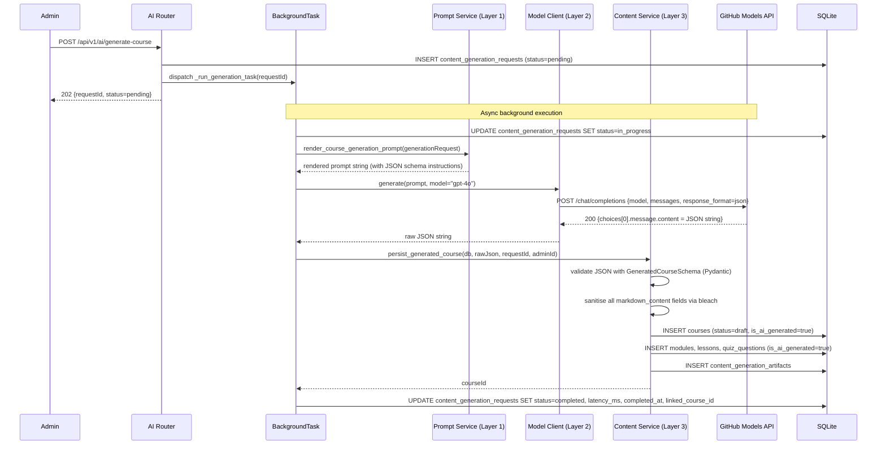
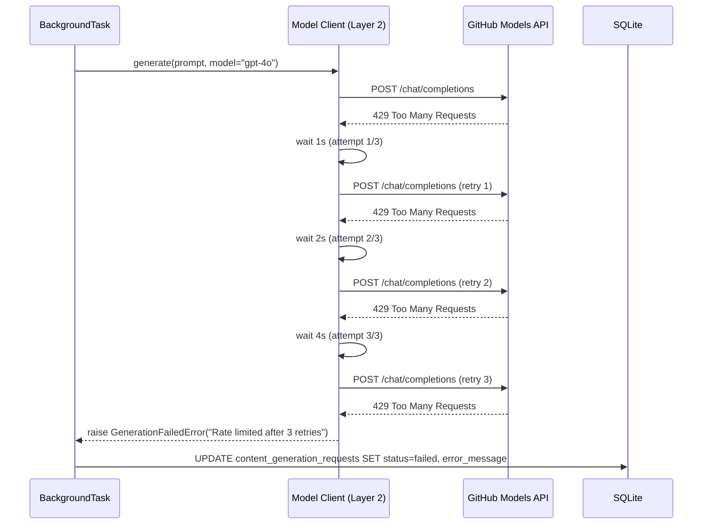

# AI Generation Service — Low-Level Design (LLD)

| Field                    | Value                                          |
|--------------------------|------------------------------------------------|
| **Title**                | AI Generation Service — Low-Level Design       |
| **Component**            | AI Generation Service                          |
| **Version**              | 1.0                                            |
| **Date**                 | 2026-03-26                                     |
| **Author**               | 2-plan-and-design-agent                        |
| **HLD Component Ref**    | COMP-003                                       |

---

## 1. Component Purpose & Scope

### 1.1 Purpose

The AI Generation Service integrates the Learning Platform with the GitHub Models API (GPT-4o) to enable AI-assisted course authoring. It is responsible for accepting admin generation requests, constructing structured prompts from reusable templates, calling the GitHub Models API asynchronously, validating and sanitising the JSON response, persisting all generated content as draft artifacts, and maintaining a complete audit trail of every generation call.

This component satisfies BRD-FR-029 through BRD-FR-037, all BRD-INT requirements, BRD-NFR-002, BRD-NFR-005, BRD-NFR-011, BRD-NFR-012, BRD-NFR-013, and BRD-NFR-014.

It is deliberately structured as **four separated, independently testable layers** to enable future MCP tool exposure (BRD-INT-008) without refactoring:

1. **Prompt Orchestration Layer** — template selection and rendering
2. **Model Invocation Layer** — httpx client, retry logic, timeout enforcement
3. **Content Persistence Layer** — Pydantic validation, bleach sanitisation, DB insert
4. **Review Workflow Layer** — admin-facing draft inspection and regeneration endpoints

### 1.2 Scope

- **Responsible for**: GitHub Models API integration, prompt template management (5 templates), async generation dispatch via `BackgroundTasks`, `ContentGenerationRequest` and `ContentGenerationArtifact` record lifecycle, exponential backoff retry, timeout enforcement, generation status polling, section-level regeneration, and AI generation audit logging.
- **Not responsible for**: Publishing AI-generated content (COMP-002 `publish_course()`), displaying the admin review UI (COMP-007), quiz scoring (COMP-004), or general course CRUD (COMP-002).
- **Interfaces with**:
  - **COMP-001 (Auth Service)**: `require_admin()` gates all generation endpoints.
  - **COMP-002 (Course Management)**: calls `create_course()`, `create_module()`, `create_lesson()`, `create_quiz_question()` to persist draft content.
  - **COMP-006 (Data Layer)**: reads/writes `content_generation_requests` and `content_generation_artifacts` tables.

---

## 2. Detailed Design

### 2.1 Module / Class Structure

```
src/
└── ai_generation/
    ├── __init__.py
    ├── router.py               # FastAPI routes: /api/v1/ai/*
    ├── prompt_service.py       # Layer 1: Prompt Orchestration — template selection and rendering
    ├── model_client.py         # Layer 2: Model Invocation — httpx client, retry, timeout
    ├── content_service.py      # Layer 3: Content Persistence — Pydantic validation, DB insert
    ├── review_router.py        # Layer 4: Review Workflow — admin draft inspection, regeneration
    ├── prompt_templates.py     # Five reusable prompt template constants (PT-001 through PT-005)
    ├── models.py               # Pydantic schemas for generation requests/responses/artifacts
    ├── dependencies.py         # Shared Depends() helpers
    └── exceptions.py           # GenerationFailedError, PromptTemplateNotFoundError, SchemaValidationError
```

### 2.2 Key Classes & Functions

| Class / Function                    | File                  | Description                                                                                                | Inputs                                                          | Outputs                                   |
|-------------------------------------|-----------------------|------------------------------------------------------------------------------------------------------------|-----------------------------------------------------------------|-------------------------------------------|
| `GenerationRequest`                 | `models.py`           | Pydantic model for POST /api/v1/ai/generate-course body                                                    | `topic, targetAudience, learningObjectives[], difficulty, desiredModuleCount, preferredTone` | Validated generation request |
| `GenerationStatusResponse`          | `models.py`           | Pydantic model for generation status poll response                                                         | `requestId, status, courseId, errorMessage, latencyMs`          | Status payload                            |
| `GeneratedCourseSchema`             | `models.py`           | Pydantic model validating the JSON output from GPT-4o (Course + nested Modules/Lessons/Quiz)               | Raw JSON from model response                                    | Validated course structure                |
| `PromptTemplate`                    | `models.py`           | Data class representing a prompt template with id, name, and template string                               | `id, name, template`                                            | Rendered prompt string                    |
| `PROMPT_TEMPLATES`                  | `prompt_templates.py` | Dict of 5 PromptTemplate constants keyed by template ID (PT-001 through PT-005)                           | —                                                               | `dict[str, PromptTemplate]`               |
| `get_prompt_template()`             | `prompt_service.py`   | Returns a PromptTemplate by ID; raises `PromptTemplateNotFoundError` if not found                         | `template_id: str`                                              | `PromptTemplate`                          |
| `render_course_generation_prompt()` | `prompt_service.py`   | Renders PT-001 with generation request parameters; includes JSON schema instruction                        | `GenerationRequest`                                             | `str` (rendered prompt)                   |
| `render_section_regeneration_prompt()` | `prompt_service.py` | Renders appropriate template (PT-002/PT-003/PT-004/PT-005) for section regeneration                       | `section_type, section_context, template_id`                    | `str` (rendered prompt)                   |
| `GitHubModelsClient`                | `model_client.py`     | Thin async wrapper around `httpx.AsyncClient`; handles retry, timeout, and error mapping                   | Configured via settings (endpoint, api_key, timeout, max_retries) | —                                       |
| `GitHubModelsClient.generate()`     | `model_client.py`     | Calls GitHub Models chat completions endpoint; applies exponential backoff on 429/5xx                      | `prompt: str`, `model: str = "gpt-4o"`                          | `str` (raw JSON response)                 |
| `persist_generated_course()`        | `content_service.py`  | Validates JSON against `GeneratedCourseSchema`, sanitises Markdown, inserts draft Course/Modules/Lessons/Quiz | `db`, `raw_json: str`, `request_id: str`, `admin_id: str`      | `str` (courseId)                          |
| `persist_generated_section()`       | `content_service.py`  | Validates and persists a single regenerated section (module/lesson/quiz)                                   | `db`, `raw_json: str`, `section_type: str`, `section_id: str`   | `str` (sectionId)                         |
| `trigger_course_generation()`       | `router.py`           | POST /api/v1/ai/generate-course handler; creates ContentGenerationRequest; dispatches BackgroundTask        | `request: GenerationRequest`, `background_tasks: BackgroundTasks`, `db`, `admin: TokenPayload` | `GenerationStatusResponse` (202) |
| `_run_generation_task()`            | `router.py`           | BackgroundTask function: orchestrates prompt → model call → persist → status update                        | `request_id, generation_request, db, admin_id`                  | `None` (side-effects only)                |
| `get_generation_status()`           | `router.py`           | GET /api/v1/ai/requests/{id} handler; returns ContentGenerationRequest status                              | `request_id: str`, `db`, `admin: TokenPayload`                  | `GenerationStatusResponse`                |
| `trigger_section_regeneration()`    | `review_router.py`    | POST /api/v1/ai/regenerate-section; triggers scoped regeneration for one section                            | `SectionRegenerationRequest`, `background_tasks`, `db`, `admin` | `GenerationStatusResponse` (202)          |

### 2.3 Design Patterns Used

- **Layered architecture (Prompt → Invocation → Persistence → Review)**: Each layer is a separate module with no circular imports. The Model Invocation layer can be wrapped by an MCP server without touching the other layers.
- **BackgroundTasks (FastAPI)**: Generation is dispatched asynchronously; the endpoint returns 202 immediately with a `generationRequestId`. Admin polls `GET /api/v1/ai/requests/{id}` for status.
- **Exponential backoff**: Implemented in `GitHubModelsClient.generate()` using `asyncio.sleep()` with doubling delays; max retries configurable via environment variable.
- **Repository pattern**: `content_service.py` uses injected `AsyncSession` rather than direct DB calls, enabling test mocking.
- **Fail-fast secrets validation**: `pydantic-settings` raises `ValidationError` at application startup if `GITHUB_MODELS_API_KEY` or `GITHUB_MODELS_ENDPOINT` are missing.

---

## 3. Data Models

### 3.1 Pydantic Models

```python
from pydantic import BaseModel, Field
from typing import Literal, Optional
from datetime import datetime


class GenerationRequest(BaseModel):
    """Request body for POST /api/v1/ai/generate-course."""
    topic: str = Field(min_length=3, max_length=200)
    target_audience: str = Field(min_length=5, max_length=500)
    learning_objectives: list[str] = Field(min_length=1, max_items=10)
    difficulty: Literal["beginner", "intermediate", "advanced"]
    desired_module_count: int = Field(ge=1, le=10, default=5)
    preferred_tone: Literal["formal", "conversational", "technical"] = "conversational"


class SectionRegenerationRequest(BaseModel):
    """Request body for POST /api/v1/ai/regenerate-section."""
    section_type: Literal["module", "lesson", "quiz"]
    section_id: str
    template_id: str = Field(default="PT-002")   # Which prompt template to use
    additional_context: Optional[str] = Field(default=None, max_length=500)


class GenerationStatusResponse(BaseModel):
    """Response for generation request status poll."""
    request_id: str
    status: Literal["pending", "in_progress", "completed", "failed"]
    course_id: Optional[str] = None
    error_message: Optional[str] = None
    latency_ms: Optional[int] = None
    created_at: datetime
    completed_at: Optional[datetime] = None


# ── Schema for validating GPT-4o JSON output ──────────────────────────────────

class GeneratedLesson(BaseModel):
    """Validated GPT-4o output schema for a single lesson."""
    title: str
    markdown_content: str
    estimated_minutes: int = Field(ge=1, le=120)


class GeneratedQuizQuestion(BaseModel):
    """Validated GPT-4o output schema for a quiz question."""
    question: str
    options: list[str] = Field(min_length=2, max_length=5)
    correct_answer: str
    explanation: str


class GeneratedModule(BaseModel):
    """Validated GPT-4o output schema for a module."""
    title: str
    summary: str
    lessons: list[GeneratedLesson] = Field(min_length=1)
    quiz_questions: list[GeneratedQuizQuestion] = Field(default_factory=list)


class GeneratedCourseSchema(BaseModel):
    """Top-level schema that GPT-4o must return; validated before persistence."""
    title: str
    description: str
    target_audience: str
    learning_objectives: list[str]
    modules: list[GeneratedModule] = Field(min_length=1)
    key_takeaways: list[str] = Field(default_factory=list)


# ── Audit entities ─────────────────────────────────────────────────────────────

class ContentGenerationRequestOut(BaseModel):
    """API response for a ContentGenerationRequest record."""
    id: str
    prompt_text: str
    model_used: str
    requester_id: str
    status: Literal["pending", "in_progress", "completed", "failed"]
    template_id: Optional[str] = None
    created_at: datetime
    completed_at: Optional[datetime] = None
    latency_ms: Optional[int] = None
    error_message: Optional[str] = None

    model_config = {"from_attributes": True}


class ContentGenerationArtifactOut(BaseModel):
    """API response for a ContentGenerationArtifact record."""
    id: str
    source_request_id: str
    generated_content: dict              # Stored as JSON
    content_type: Literal["course", "module", "lesson", "quiz"]
    approved_by: Optional[str] = None
    approved_at: Optional[datetime] = None

    model_config = {"from_attributes": True}
```

### 3.2 Database Schema

```sql
CREATE TABLE content_generation_requests (
    id               TEXT PRIMARY KEY,                  -- UUID v4
    prompt_text      TEXT NOT NULL,
    model_used       TEXT NOT NULL DEFAULT 'gpt-4o',
    requester_id     TEXT NOT NULL REFERENCES users(id),
    status           TEXT NOT NULL DEFAULT 'pending'
                         CHECK(status IN ('pending','in_progress','completed','failed')),
    template_id      TEXT,                             -- PT-001 through PT-005
    section_type     TEXT,                             -- NULL for full course; 'module'|'lesson'|'quiz' for section regen
    section_id       TEXT,                             -- FK to the specific section being regenerated
    created_at       TIMESTAMP NOT NULL DEFAULT CURRENT_TIMESTAMP,
    completed_at     TIMESTAMP,
    latency_ms       INTEGER,
    error_message    TEXT
);

CREATE TABLE content_generation_artifacts (
    id                  TEXT PRIMARY KEY,              -- UUID v4
    source_request_id   TEXT NOT NULL REFERENCES content_generation_requests(id) ON DELETE CASCADE,
    generated_content   TEXT NOT NULL,                 -- JSON blob (validated against GeneratedCourseSchema)
    content_type        TEXT NOT NULL
                            CHECK(content_type IN ('course','module','lesson','quiz')),
    linked_course_id    TEXT REFERENCES courses(id),   -- Set after draft Course is persisted
    approved_by         TEXT REFERENCES users(id),
    approved_at         TIMESTAMP,
    created_at          TIMESTAMP NOT NULL DEFAULT CURRENT_TIMESTAMP
);

CREATE INDEX idx_gen_requests_requester ON content_generation_requests(requester_id);
CREATE INDEX idx_gen_requests_status    ON content_generation_requests(status);
CREATE INDEX idx_gen_artifacts_request  ON content_generation_artifacts(source_request_id);
```

---

## 4. API Specifications

### 4.1 Endpoints

| Method | Path                                      | Auth  | Description                                                                         | Request Body                   | Response Body                   | Status Codes      |
|--------|-------------------------------------------|-------|--------------------------------------------------------------------------------------|--------------------------------|---------------------------------|-------------------|
| POST   | `/api/v1/ai/generate-course`              | Admin | Trigger full course generation; returns immediately with requestId                   | `GenerationRequest`            | `GenerationStatusResponse`      | 202, 400, 422     |
| GET    | `/api/v1/ai/requests/{request_id}`        | Admin | Poll generation status; returns courseId on completion                               | —                              | `GenerationStatusResponse`      | 200, 404          |
| GET    | `/api/v1/ai/requests`                     | Admin | List all past ContentGenerationRequests (audit log)                                  | —                              | `list[ContentGenerationRequestOut]` | 200           |
| POST   | `/api/v1/ai/regenerate-section`           | Admin | Trigger regeneration of a single module/lesson/quiz section                          | `SectionRegenerationRequest`   | `GenerationStatusResponse`      | 202, 400, 422     |
| GET    | `/api/v1/ai/requests/{request_id}/artifact` | Admin | Get the ContentGenerationArtifact linked to a completed request                    | —                              | `ContentGenerationArtifactOut`  | 200, 404          |

### 4.2 Request / Response Examples

```json
// POST /api/v1/ai/generate-course
{
    "topic": "GitHub Actions",
    "target_audience": "Junior developers familiar with basic GitHub",
    "learning_objectives": [
        "Understand workflow YAML syntax",
        "Create a CI pipeline with automated tests",
        "Use matrix builds for multi-platform testing"
    ],
    "difficulty": "beginner",
    "desired_module_count": 5,
    "preferred_tone": "conversational"
}
```

```json
// 202 Accepted
{
    "request_id": "req-550e8400-e29b-41d4-a716-446655440001",
    "status": "pending",
    "course_id": null,
    "error_message": null,
    "latency_ms": null,
    "created_at": "2026-03-26T10:30:00Z",
    "completed_at": null
}
```

```json
// GET /api/v1/ai/requests/req-550e8400-... — after completion
{
    "request_id": "req-550e8400-e29b-41d4-a716-446655440001",
    "status": "completed",
    "course_id": "crs-a1b2c3d4-e5f6-7890-abcd-ef1234567890",
    "error_message": null,
    "latency_ms": 18420,
    "created_at": "2026-03-26T10:30:00Z",
    "completed_at": "2026-03-26T10:30:18Z"
}
```

---

## 5. Sequence Diagrams

### 5.1 Primary Flow — Successful Full Course Generation



### 5.2 Error Flow — GitHub Models Rate Limit (429)



---

## 6. Error Handling Strategy

### 6.1 Exception Hierarchy

| Exception Class                | HTTP Status | Description                                                                    | Retry?         |
|--------------------------------|-------------|--------------------------------------------------------------------------------|----------------|
| `GenerationFailedError`        | —           | Internal; transitions ContentGenerationRequest to `failed` (not surfaced as HTTP) | Admin retries manually |
| `PromptTemplateNotFoundError`  | 400         | Requested template ID does not exist in PROMPT_TEMPLATES                       | No             |
| `SchemaValidationError`        | —           | GPT-4o response does not conform to `GeneratedCourseSchema`; logged and set to `failed` | Admin retries |
| `ModelTimeoutError`            | —           | httpx timeout after 60 s; status set to `failed`                               | Admin retries  |
| `GenerationRequestNotFoundError` | 404       | `ContentGenerationRequest` ID not found                                        | No             |

**Note**: Background task failures do NOT result in HTTP error responses to the client. The client discovers failure by polling `GET /api/v1/ai/requests/{id}` and observing `status=failed` with `errorMessage`.

### 6.2 Error Response Format

```json
// For synchronous endpoint errors (e.g., missing required field)
{
    "error": {
        "code": "VALIDATION_ERROR",
        "message": "Field 'topic' is required.",
        "details": [{"field": "topic", "msg": "Field required"}]
    }
}
```

```json
// For polled generation failure
{
    "request_id": "req-550e8400...",
    "status": "failed",
    "course_id": null,
    "error_message": "GitHub Models API returned 429 after 3 retries. Please try again later.",
    "latency_ms": 14000,
    "created_at": "2026-03-26T10:30:00Z",
    "completed_at": "2026-03-26T10:30:14Z"
}
```

### 6.3 Logging

| Event                                  | Level   | Fields Logged                                                                          |
|----------------------------------------|---------|----------------------------------------------------------------------------------------|
| Generation request created             | INFO    | `event=AI_GENERATION_STARTED`, `requestId`, `adminId`, `topic`, `templateId`          |
| GitHub Models API call initiated       | INFO    | `event=AI_API_CALL`, `requestId`, `model`, `endpoint`                                 |
| GitHub Models API retry                | WARNING | `event=AI_API_RETRY`, `requestId`, `attempt`, `statusCode`, `waitSeconds`             |
| GitHub Models API success              | INFO    | `event=AI_API_SUCCESS`, `requestId`, `model`, `latencyMs`                             |
| GitHub Models API failure (final)      | ERROR   | `event=AI_API_FAILURE`, `requestId`, `statusCode`, `errorDetail`, `latencyMs`         |
| Generation completed                   | INFO    | `event=AI_GENERATION_COMPLETED`, `requestId`, `courseId`, `latencyMs`                 |
| Generation failed                      | ERROR   | `event=AI_GENERATION_FAILED`, `requestId`, `errorMessage`, `latencyMs`                |
| Schema validation failed               | ERROR   | `event=AI_SCHEMA_VALIDATION_FAILED`, `requestId`; raw response logged at DEBUG only   |

API keys and prompt secrets are **never** logged.

---

## 7. Configuration & Environment Variables

| Variable                     | Description                                                   | Required | Default                                             |
|------------------------------|---------------------------------------------------------------|----------|-----------------------------------------------------|
| `GITHUB_MODELS_API_KEY`      | Bearer token for GitHub Models API authentication             | Yes      | —                                                   |
| `GITHUB_MODELS_ENDPOINT`     | Base URL for GitHub Models API                                | Yes      | —                                                   |
| `GITHUB_MODELS_MODEL_NAME`   | Model name to use for generation                              | No       | `gpt-4o`                                            |
| `AI_MAX_RETRIES`             | Maximum retry count for rate-limited / 5xx responses          | No       | `3`                                                 |
| `AI_RETRY_BASE_DELAY_SECONDS`| Base delay in seconds for exponential backoff (doubles each retry) | No   | `1`                                                 |
| `AI_REQUEST_TIMEOUT_SECONDS` | httpx client timeout per request in seconds                   | No       | `60`                                                |

---

## 8. Dependencies

### 8.1 Internal Dependencies

| Component   | Purpose                                                                             | Interface                                              |
|-------------|-------------------------------------------------------------------------------------|--------------------------------------------------------|
| COMP-001    | `require_admin()` gates all generation endpoints                                    | `Depends(require_admin)` in router definitions         |
| COMP-002    | Service functions `create_course()`, `create_module()`, `create_lesson()`, `create_quiz_question()` used to persist draft content | Direct Python function calls in `content_service.py` |
| COMP-006    | Read/write `content_generation_requests` and `content_generation_artifacts` tables  | `AsyncSession` via `Depends(get_db)`                   |

### 8.2 External Dependencies

| Package / Service  | Version | Purpose                                                                              |
|--------------------|---------|--------------------------------------------------------------------------------------|
| `httpx`            | 0.27+   | Async HTTP client for GitHub Models API calls; timeout and retry support             |
| `fastapi`          | 0.111+  | Router, `BackgroundTasks`, `Depends()`, `HTTPException`                              |
| `pydantic`         | 2.x     | `GeneratedCourseSchema` and all request/response model validation                    |
| `pydantic-settings`| 2.x     | Load `GITHUB_MODELS_API_KEY`, `GITHUB_MODELS_ENDPOINT`, and retry config from env   |
| `bleach`           | 6.x     | Sanitise `markdown_content` fields in AI-generated lessons before DB insert          |

---

## 9. MCP Readiness Notes

The **Model Invocation Layer** (`model_client.py`) exposes a single async `generate(prompt, model)` function with no dependencies on other layers. To expose this as an MCP tool in a future release:

1. Create `src/mcp_server/tools/generate_content.py` that imports `GitHubModelsClient.generate()`.
2. Register it as an MCP tool with input schema matching `GenerationRequest`.
3. No changes to any other layer are required.

The intended MCP tool interface (per BRD-INT-009):

| MCP Tool Name                  | Maps to Layer                      | Description                                    |
|--------------------------------|------------------------------------|------------------------------------------------|
| `generate_course_outline`      | Prompt Service + Model Client      | Generate course structure from topic/objectives |
| `generate_lesson_content`      | Prompt Service + Model Client      | Generate Markdown lesson for given context     |
| `generate_quiz_questions`      | Prompt Service + Model Client      | Generate MCQ questions for a module            |
| `fetch_course_template_context`| Content Persistence (read)         | Fetch existing course structure for context    |
| `validate_generated_content`   | Content Persistence (validate)     | Validate JSON content against GeneratedCourseSchema |

---

## 10. Traceability

| LLD Element                                         | HLD Component | BRD Requirement(s)                                                  |
|-----------------------------------------------------|---------------|---------------------------------------------------------------------|
| `GenerationRequest` model + trigger endpoint        | COMP-003      | BRD-FR-029 (generation request fields)                              |
| `GeneratedCourseSchema` + persistence               | COMP-003      | BRD-FR-030 (generates all 6 content types)                          |
| `status=draft` default on all generated content     | COMP-003      | BRD-FR-031 (AI content never auto-published)                        |
| `ContentGenerationRequest` audit record             | COMP-003      | BRD-FR-032, BRD-INT-010 (generation metadata stored)                |
| `is_ai_generated=True` flag                         | COMP-003      | BRD-FR-033, BRD-FR-039 (AI-generated draft label)                   |
| `POST /api/v1/ai/regenerate-section`                | COMP-003      | BRD-FR-034 (regenerate single section)                              |
| `GenerationFailedError` + error message in response | COMP-003      | BRD-FR-035, BRD-NFR-011, BRD-NFR-012 (failures are retryable, do not affect published courses) |
| `PROMPT_TEMPLATES` dict (PT-001 to PT-005)          | COMP-003      | BRD-FR-036, BRD-INT-007 (5 reusable prompt templates)               |
| `bleach` sanitise in `persist_generated_course()`   | COMP-003      | BRD-FR-037, BRD-NFR-006 (XSS sanitisation)                          |
| `GITHUB_MODELS_API_KEY` env var only                | COMP-003      | BRD-INT-001, BRD-NFR-005 (no hardcoded key)                         |
| `GITHUB_MODELS_ENDPOINT` env var                    | COMP-003      | BRD-INT-002 (configurable endpoint, gpt-4o model)                   |
| Exponential backoff (max 3 retries)                 | COMP-003      | BRD-INT-003 (429 handling with backoff)                             |
| `try/except` + sanitised error messages             | COMP-003      | BRD-INT-004 (no raw API errors exposed)                             |
| httpx 60 s timeout                                  | COMP-003      | BRD-INT-005 (60 s timeout on all API calls)                         |
| `GeneratedCourseSchema` (strict JSON schema)        | COMP-003      | BRD-INT-006 (structured content schema with Pydantic validation)    |
| 4-layer module structure                            | COMP-003      | BRD-INT-008 (MCP-ready layered design)                              |
| MCP tool interface documented                       | COMP-003      | BRD-INT-009 (MCP readiness, future release)                         |
| AI generation latency logging                       | COMP-003      | BRD-NFR-013, BRD-NFR-014 (observability: generation events + latency) |
| 202 + async BackgroundTask                          | COMP-003      | BRD-NFR-002 (async generation; status endpoint < 500 ms)            |
