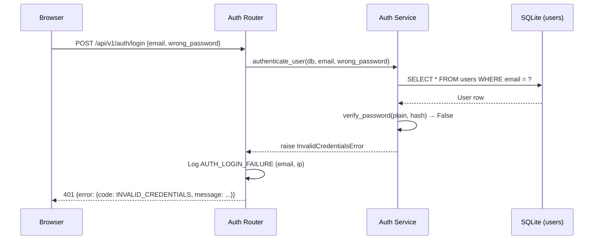
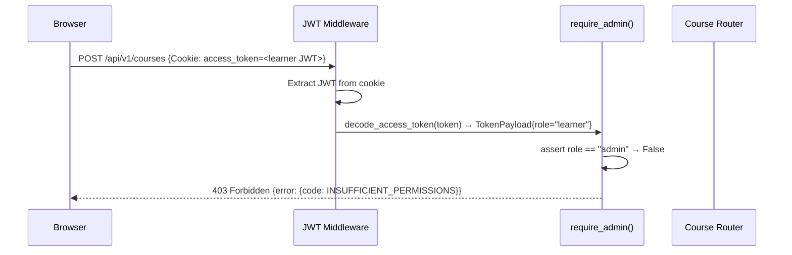

# Auth Service — Low-Level Design (LLD)

| Field                    | Value                                          |
|--------------------------|------------------------------------------------|
| **Title**                | Auth Service — Low-Level Design                |
| **Component**            | Auth Service                                   |
| **Version**              | 1.0                                            |
| **Date**                 | 2026-03-26                                     |
| **Author**               | 2-plan-and-design-agent                        |
| **HLD Component Ref**    | COMP-001                                       |

---

## 1. Component Purpose & Scope

### 1.1 Purpose

The Auth Service is the security gateway for the entire Learning Platform. It is responsible for authenticating users (sign-in with email/password), issuing short-lived JWT tokens stored in HTTP-only cookies, and enforcing Role-Based Access Control (RBAC) on every protected API endpoint. It satisfies BRD-FR-001 through BRD-FR-004, BRD-NFR-004, BRD-NFR-005, and BRD-NFR-013.

Every other service module relies on the Auth Service's FastAPI dependency functions (`require_authenticated_user`, `require_admin`, `require_learner`) to gate access. The Auth Service does not issue certificates, support SSO, or integrate with external identity providers in MVP.

### 1.2 Scope

- **Responsible for**: User sign-in (email + password validation), JWT issuance, JWT validation middleware, RBAC dependency injection functions, sign-out (cookie clearing), and logging of auth events.
- **Not responsible for**: User registration (handled by the seed script / admin-only user creation endpoint), password reset flows, SSO/OAuth, multi-factor authentication, and session storage (stateless JWT).
- **Interfaces with**:
  - **COMP-006 (Data Layer)**: reads `users` table to validate credentials and load user identity.
  - **All other COMP-002 through COMP-005 routers**: they declare `Depends(require_admin)` or `Depends(require_authenticated_user)` to gate their endpoints.

---

## 2. Detailed Design

### 2.1 Module / Class Structure

```
src/
└── auth/
    ├── __init__.py
    ├── router.py          # POST /api/v1/auth/login, POST /api/v1/auth/logout
    ├── service.py         # Business logic: verify credentials, issue token, validate token
    ├── models.py          # Pydantic request/response schemas (LoginRequest, TokenPayload, UserOut)
    ├── dependencies.py    # FastAPI Depends() functions: require_authenticated_user, require_admin, require_learner
    └── exceptions.py      # InvalidCredentialsError, InsufficientPermissionsError, TokenExpiredError
```

### 2.2 Key Classes & Functions

| Class / Function                | File               | Description                                                                                  | Inputs                                        | Outputs                                  |
|---------------------------------|--------------------|----------------------------------------------------------------------------------------------|-----------------------------------------------|------------------------------------------|
| `LoginRequest`                  | `models.py`        | Pydantic model for sign-in request body                                                      | `email: EmailStr`, `password: str`            | Validated login payload                  |
| `TokenPayload`                  | `models.py`        | Pydantic model for JWT claims                                                                | `sub: str` (userId), `role: str`, `exp: int`  | JWT claims dict                          |
| `UserOut`                       | `models.py`        | Pydantic model for authenticated user response (excludes passwordHash)                       | `id, name, email, role, createdAt`            | Serialised user object                   |
| `verify_password()`             | `service.py`       | Compares a plain-text password against a stored bcrypt hash                                  | `plain: str`, `hashed: str`                   | `bool`                                   |
| `hash_password()`               | `service.py`       | Hashes a plain-text password using bcrypt via passlib CryptContext                           | `plain: str`                                  | `str` (hashed)                           |
| `create_access_token()`         | `service.py`       | Creates a signed JWT with `sub` (userId), `role`, and `exp` claims                          | `data: dict`, `expires_delta: timedelta`      | `str` (JWT)                              |
| `decode_access_token()`         | `service.py`       | Decodes and validates a JWT; raises `TokenExpiredError` if expired                           | `token: str`                                  | `TokenPayload`                           |
| `authenticate_user()`           | `service.py`       | Queries DB for user by email, verifies password; raises `InvalidCredentialsError` on failure | `db: AsyncSession`, `email: str`, `password: str` | `User` ORM model                     |
| `login_endpoint()`              | `router.py`        | POST /api/v1/auth/login handler; calls `authenticate_user`, sets JWT cookie, logs event      | `request: LoginRequest`, `db: AsyncSession`   | `JSONResponse` with HTTP-only cookie     |
| `logout_endpoint()`             | `router.py`        | POST /api/v1/auth/logout handler; clears JWT cookie                                         | `response: Response`                          | `JSONResponse` (cookie cleared)          |
| `require_authenticated_user()`  | `dependencies.py`  | FastAPI dependency; extracts JWT from cookie, decodes it, returns `TokenPayload`             | `request: Request`                            | `TokenPayload`                           |
| `require_admin()`               | `dependencies.py`  | FastAPI dependency; calls `require_authenticated_user`, asserts `role == "admin"`            | `user: TokenPayload`                          | `TokenPayload`                           |
| `require_learner()`             | `dependencies.py`  | FastAPI dependency; calls `require_authenticated_user`, asserts `role == "learner"`          | `user: TokenPayload`                          | `TokenPayload`                           |
| `require_own_data()`            | `dependencies.py`  | FastAPI dependency; asserts authenticated user's id matches the `userId` path/query param    | `user: TokenPayload`, `userId: str`           | `TokenPayload`                           |

### 2.3 Design Patterns Used

- **Dependency Injection via `FastAPI.Depends()`**: All RBAC checks are composable dependencies injected into route functions — no manual role checks inside business logic.
- **Repository pattern (via COMP-006)**: `authenticate_user()` uses an injected `AsyncSession` rather than direct SQLite calls, keeping the service testable with a mock session.
- **Stateless JWT**: Tokens are self-contained (no server-side session store). Expiration is enforced at decode time.
- **HTTP-only cookie**: JWT is stored in a cookie with `HttpOnly=True`, `SameSite="strict"`, and `Secure=True` in production, preventing JavaScript access and CSRF.

---

## 3. Data Models

### 3.1 Pydantic Models

```python
from pydantic import BaseModel, EmailStr, Field
from typing import Literal
from datetime import datetime


class LoginRequest(BaseModel):
    """Request body for POST /api/v1/auth/login."""
    email: EmailStr
    password: str = Field(min_length=8, max_length=128)


class TokenPayload(BaseModel):
    """JWT claims decoded from the auth cookie."""
    sub: str          # User UUID as string
    role: Literal["learner", "admin"]
    exp: int          # Unix timestamp expiration


class UserOut(BaseModel):
    """Authenticated user details returned after login (no password hash)."""
    id: str
    name: str
    email: EmailStr
    role: Literal["learner", "admin"]
    created_at: datetime

    model_config = {"from_attributes": True}


class LoginResponse(BaseModel):
    """Response body for a successful login."""
    message: str = "Login successful"
    user: UserOut


class LogoutResponse(BaseModel):
    """Response body for a successful logout."""
    message: str = "Logout successful"
```

### 3.2 Database Schema

```sql
-- Owned by COMP-006 Data Layer; Auth Service reads this table.
CREATE TABLE users (
    id          TEXT PRIMARY KEY,                           -- UUID v4
    name        TEXT NOT NULL,
    email       TEXT NOT NULL UNIQUE,
    password_hash TEXT NOT NULL,                           -- bcrypt hash
    role        TEXT NOT NULL CHECK(role IN ('learner', 'admin')),
    created_at  TIMESTAMP NOT NULL DEFAULT CURRENT_TIMESTAMP
);

CREATE INDEX idx_users_email ON users(email);
```

---

## 4. API Specifications

### 4.1 Endpoints

| Method | Path                        | Auth Required | Description                                                               | Request Body    | Response Body   | Status Codes            |
|--------|-----------------------------|---------------|---------------------------------------------------------------------------|-----------------|-----------------|-------------------------|
| POST   | `/api/v1/auth/login`        | None          | Authenticates user; sets HTTP-only JWT cookie on success                  | `LoginRequest`  | `LoginResponse` | 200, 401, 422           |
| POST   | `/api/v1/auth/logout`       | Any JWT       | Clears the JWT cookie                                                     | —               | `LogoutResponse`| 200                     |
| GET    | `/api/v1/auth/me`           | Any JWT       | Returns the currently authenticated user's profile                        | —               | `UserOut`       | 200, 401                |

### 4.2 Request / Response Examples

```json
// POST /api/v1/auth/login
{
    "email": "admin@example.com",
    "password": "S3cur3P@ssw0rd"
}
```

```json
// 200 OK — login successful (JWT set in Set-Cookie header)
{
    "message": "Login successful",
    "user": {
        "id": "550e8400-e29b-41d4-a716-446655440000",
        "name": "Platform Admin",
        "email": "admin@example.com",
        "role": "admin",
        "created_at": "2026-03-01T09:00:00Z"
    }
}
```

```json
// 401 Unauthorized — invalid credentials
{
    "error": {
        "code": "INVALID_CREDENTIALS",
        "message": "Incorrect email or password.",
        "details": null
    }
}
```

---

## 5. Sequence Diagrams

### 5.1 Primary Flow — Successful Sign-In

```mermaid
sequenceDiagram
    participant Browser
    participant Router as Auth Router
    participant Service as Auth Service
    participant DB as SQLite (users)

    Browser->>Router: POST /api/v1/auth/login {email, password}
    Router->>Router: Pydantic validates LoginRequest
    Router->>Service: authenticate_user(db, email, password)
    Service->>DB: SELECT * FROM users WHERE email = ?
    DB-->>Service: User row (with password_hash)
    Service->>Service: verify_password(plain, hash) → True
    Service-->>Router: User ORM object
    Router->>Service: create_access_token({sub: userId, role})
    Service-->>Router: JWT string
    Router->>Router: Log AUTH_LOGIN_SUCCESS (userId, role, ip)
    Router-->>Browser: 200 LoginResponse + Set-Cookie: access_token=<JWT>; HttpOnly; SameSite=Strict
```

### 5.2 Error Flow — Invalid Credentials



### 5.3 RBAC Flow — Admin Endpoint with Learner Token



---

## 6. Error Handling Strategy

### 6.1 Exception Hierarchy

| Exception Class               | HTTP Status | Description                                                           | Retry? |
|-------------------------------|-------------|-----------------------------------------------------------------------|--------|
| `InvalidCredentialsError`     | 401         | Email not found or password does not match                            | No     |
| `TokenExpiredError`           | 401         | JWT has passed its `exp` claim                                        | No     |
| `TokenInvalidError`           | 401         | JWT signature invalid or malformed                                    | No     |
| `MissingTokenError`           | 401         | No JWT cookie present on a protected route                            | No     |
| `InsufficientPermissionsError`| 403         | Authenticated user's role is not authorised for the requested action  | No     |
| `OwnDataViolationError`       | 403         | Learner attempting to access another learner's data                   | No     |

### 6.2 Error Response Format

```json
{
    "error": {
        "code": "INVALID_CREDENTIALS",
        "message": "Incorrect email or password.",
        "details": null
    }
}
```

### 6.3 Logging

All auth events are logged using Python's `logging` module at the following levels:

| Event                              | Level   | Fields Logged                                              |
|------------------------------------|---------|------------------------------------------------------------|
| Successful login                   | INFO    | `event=AUTH_LOGIN_SUCCESS`, `userId`, `role`, `ip`        |
| Failed login (wrong password)      | WARNING | `event=AUTH_LOGIN_FAILURE`, `email`, `ip`                 |
| Failed login (user not found)      | WARNING | `event=AUTH_LOGIN_FAILURE`, `email`, `ip`                 |
| Token expired                      | WARNING | `event=AUTH_TOKEN_EXPIRED`, `userId` (from expired claims) |
| Token invalid                      | WARNING | `event=AUTH_TOKEN_INVALID`, `ip`                          |
| Logout                             | INFO    | `event=AUTH_LOGOUT`, `userId`, `ip`                       |
| RBAC violation (wrong role)        | WARNING | `event=AUTH_RBAC_VIOLATION`, `userId`, `role`, `path`     |

Passwords, JWT secrets, and full token strings are **never** logged.

---

## 7. Configuration & Environment Variables

| Variable              | Description                                               | Required | Default   |
|-----------------------|-----------------------------------------------------------|----------|-----------|
| `SECRET_KEY`          | HMAC-SHA256 secret used to sign JWTs (min 32 characters)  | Yes      | —         |
| `ACCESS_TOKEN_EXPIRE_MINUTES` | JWT lifetime in minutes                         | No       | `480` (8 h) |
| `ENVIRONMENT`         | `development` or `production` (affects cookie `Secure` flag) | No    | `development` |

---

## 8. Dependencies

### 8.1 Internal Dependencies

| Component       | Purpose                                                            | Interface                                     |
|-----------------|--------------------------------------------------------------------|-----------------------------------------------|
| COMP-006        | Read `users` table to authenticate and load user profile           | `AsyncSession` injected via `Depends(get_db)` |

### 8.2 External Dependencies

| Package / Service  | Version  | Purpose                                                          |
|--------------------|----------|------------------------------------------------------------------|
| `python-jose`      | 3.x      | JWT encoding and decoding (HMAC-SHA256)                          |
| `passlib[bcrypt]`  | 1.7+     | Secure password hashing and verification via bcrypt              |
| `fastapi`          | 0.111+   | Router, `Depends()`, `Request`, `Response`, `JSONResponse`       |
| `pydantic[email]`  | 2.x      | `EmailStr` validator for login request                           |
| `pydantic-settings`| 2.x      | Load `SECRET_KEY`, `ACCESS_TOKEN_EXPIRE_MINUTES` from env        |

---

## 9. Traceability

| LLD Element                          | HLD Component | BRD Requirement(s)                              |
|--------------------------------------|---------------|-------------------------------------------------|
| `LoginRequest` + `login_endpoint()`  | COMP-001      | BRD-FR-001 (sign-in with email/password)        |
| `TokenPayload.role` + `UserOut.role` | COMP-001      | BRD-FR-002 (exactly two roles: learner/admin)   |
| `require_admin()` dependency         | COMP-001      | BRD-FR-003 (admin-only endpoints)               |
| `require_own_data()` dependency      | COMP-001      | BRD-FR-004 (learner cannot view others' data)   |
| JWT HTTP-only cookie                 | COMP-001      | BRD-NFR-004 (RBAC on every endpoint)            |
| `SECRET_KEY` env var + no logging    | COMP-001      | BRD-NFR-005 (no secrets in code or logs)        |
| Auth event logging                   | COMP-001      | BRD-NFR-013 (log auth events)                   |
