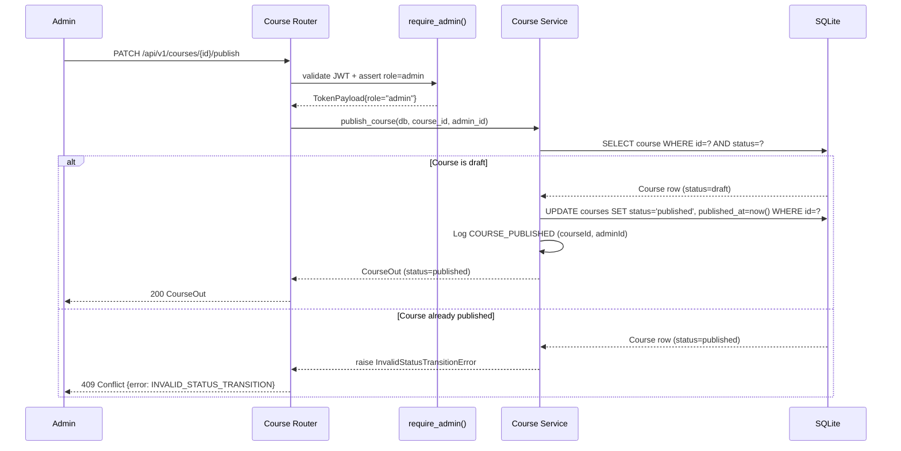
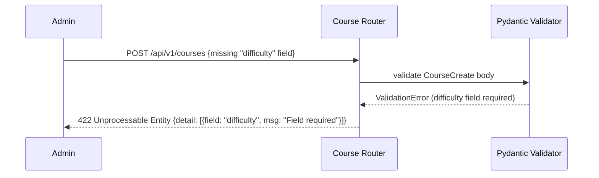

# Course Management Service — Low-Level Design (LLD)

| Field                    | Value                                              |
|--------------------------|----------------------------------------------------|
| **Title**                | Course Management Service — Low-Level Design       |
| **Component**            | Course Management Service                          |
| **Version**              | 1.0                                                |
| **Date**                 | 2026-03-26                                         |
| **Author**               | 2-plan-and-design-agent                            |
| **HLD Component Ref**    | COMP-002                                           |

---

## 1. Component Purpose & Scope

### 1.1 Purpose

The Course Management Service provides all CRUD operations for the core content hierarchy (Course → Module → Lesson → QuizQuestion), manages the draft/published status lifecycle, exposes the learner-facing course catalog with search/filter, and serves Lesson content with server-side Markdown sanitisation to prevent XSS. It satisfies BRD-FR-005 through BRD-FR-013, BRD-FR-037 through BRD-FR-044, BRD-NFR-001, and BRD-NFR-006.

It also owns the database seed script that pre-populates the three starter courses (GitHub Foundations, GitHub Advanced Security, GitHub Actions) on first launch.

### 1.2 Scope

- **Responsible for**: Course CRUD, Module CRUD, Lesson CRUD, QuizQuestion CRUD, publish/unpublish transitions, course catalog filtering, `isAiGenerated` flagging, XSS sanitisation of Markdown content, database seed script for starter courses, and revision/draft management (MVP: simple status flag).
- **Not responsible for**: Authentication/RBAC (delegated to COMP-001), enrollment (COMP-004), quiz scoring (COMP-004), AI content generation (COMP-003), progress tracking (COMP-004), and reporting (COMP-005).
- **Interfaces with**:
  - **COMP-001 (Auth Service)**: `require_admin()` and `require_authenticated_user()` dependencies gate all write endpoints.
  - **COMP-006 (Data Layer)**: reads and writes `courses`, `modules`, `lessons`, `quiz_questions` tables via `AsyncSession`.
  - **COMP-003 (AI Generation)**: AI-generated courses are created using the Course Management data models; COMP-003 calls internal service functions to persist draft content.

---

## 2. Detailed Design

### 2.1 Module / Class Structure

```
src/
└── course_management/
    ├── __init__.py
    ├── router.py          # FastAPI route definitions for /api/v1/courses/*
    ├── service.py         # Business logic: CRUD, publish/unpublish, catalog filter
    ├── models.py          # Pydantic request/response schemas
    ├── sanitiser.py       # bleach-based Markdown sanitisation helper
    ├── seed.py            # Database seed script for 3 starter courses
    ├── dependencies.py    # Shared Depends() helpers (e.g., get_course_or_404)
    └── exceptions.py      # CourseNotFoundError, DuplicateCourseError, InvalidStatusTransitionError
```

### 2.2 Key Classes & Functions

| Class / Function                  | File             | Description                                                                                         | Inputs                                              | Outputs                           |
|-----------------------------------|------------------|-----------------------------------------------------------------------------------------------------|-----------------------------------------------------|-----------------------------------|
| `CourseCreate`                    | `models.py`      | Pydantic model for POST /courses request body                                                       | All Course fields (title, description, difficulty…) | Validated course creation payload |
| `CourseOut`                       | `models.py`      | Pydantic model for Course API responses (includes nested modules if requested)                      | ORM Course row                                      | Serialised course object          |
| `ModuleCreate` / `ModuleOut`      | `models.py`      | Pydantic models for Module create and response                                                      | Module fields + courseId                            | Validated module payloads         |
| `LessonCreate` / `LessonOut`      | `models.py`      | Pydantic models for Lesson create and response; sanitises `markdownContent` on input                | Lesson fields + moduleId                            | Validated lesson payloads         |
| `QuizQuestionCreate` / `QuizQuestionOut` | `models.py` | Pydantic models for QuizQuestion; validates `options` length (2–5) and `correctAnswer` presence    | QuizQuestion fields + moduleId                      | Validated quiz payloads           |
| `sanitise_markdown()`             | `sanitiser.py`   | Strips unsafe HTML tags and attributes from Markdown strings using `bleach`                         | `raw_content: str`                                  | `str` (sanitised)                 |
| `create_course()`                 | `service.py`     | Inserts a new Course record with `status=draft`                                                     | `db: AsyncSession`, `data: CourseCreate`, `requester_id: str` | `Course` ORM object  |
| `get_course_catalog()`            | `service.py`     | Returns published courses, optionally filtered by `difficulty` and `tag`                            | `db`, `difficulty: str | None`, `tag: str | None`  | `list[CourseOut]`                 |
| `get_course_detail()`             | `service.py`     | Returns full course with nested modules, lessons, quiz questions                                    | `db`, `course_id: str`, `include_drafts: bool`      | `CourseOut` (nested)              |
| `publish_course()`                | `service.py`     | Transitions course `status` from `draft` → `published`; records `publishedAt`; logs event          | `db`, `course_id: str`, `admin_id: str`             | `CourseOut`                       |
| `unpublish_course()`              | `service.py`     | Transitions course `status` from `published` → `draft`; logs event                                 | `db`, `course_id: str`, `admin_id: str`             | `CourseOut`                       |
| `update_lesson()`                 | `service.py`     | Updates lesson content; re-sanitises Markdown; sets `isAiGenerated=False` on manual edit           | `db`, `lesson_id: str`, `data: LessonUpdate`        | `LessonOut`                       |
| `seed_starter_courses()`          | `seed.py`        | Idempotent seed function; inserts 3 starter courses if not present; runs via Alembic migration      | `db: AsyncSession`                                  | `None`                            |

### 2.3 Design Patterns Used

- **Repository pattern**: All DB access goes through `service.py` functions receiving an injected `AsyncSession`; routers never access the ORM directly.
- **Dependency injection via `FastAPI.Depends()`**: `get_course_or_404()` is a reusable dependency that fetches a course by ID and raises `HTTP 404` if not found, reducing boilerplate in route handlers.
- **Sanitise-on-write + sanitise-on-render**: `sanitise_markdown()` is called when Markdown is written to the DB, and again in the Jinja2 template layer for defence-in-depth (BRD-NFR-006).
- **Idempotent seed**: `seed_starter_courses()` checks for existence before inserting, making it safe to run multiple times.

---

## 3. Data Models

### 3.1 Pydantic Models

```python
from pydantic import BaseModel, Field, field_validator
from typing import Literal, Optional
from datetime import datetime


class CourseCreate(BaseModel):
    """Request body for creating a new course."""
    title: str = Field(min_length=3, max_length=200)
    description: str = Field(min_length=10, max_length=2000)
    difficulty: Literal["beginner", "intermediate", "advanced"]
    estimated_duration: int = Field(gt=0, description="Duration in minutes")
    target_audience: str = Field(max_length=500)
    learning_objectives: list[str] = Field(min_length=1, max_items=10)
    tags: list[str] = Field(default_factory=list)
    is_ai_generated: bool = False


class CourseUpdate(BaseModel):
    """Request body for updating an existing course (all fields optional)."""
    title: Optional[str] = Field(default=None, min_length=3, max_length=200)
    description: Optional[str] = Field(default=None, max_length=2000)
    difficulty: Optional[Literal["beginner", "intermediate", "advanced"]] = None
    estimated_duration: Optional[int] = Field(default=None, gt=0)
    target_audience: Optional[str] = Field(default=None, max_length=500)
    learning_objectives: Optional[list[str]] = None
    tags: Optional[list[str]] = None


class CourseOut(BaseModel):
    """Course API response (flat; nested detail available via separate endpoint)."""
    id: str
    title: str
    description: str
    status: Literal["draft", "published"]
    difficulty: Literal["beginner", "intermediate", "advanced"]
    estimated_duration: int
    target_audience: str
    learning_objectives: list[str]
    tags: list[str]
    is_ai_generated: bool
    created_at: datetime
    published_at: Optional[datetime] = None

    model_config = {"from_attributes": True}


class ModuleCreate(BaseModel):
    """Request body for creating a module within a course."""
    course_id: str
    title: str = Field(min_length=3, max_length=200)
    summary: str = Field(max_length=1000)
    sort_order: int = Field(ge=0)
    quiz_passing_score: int = Field(default=70, ge=0, le=100)
    is_quiz_informational: bool = False
    is_ai_generated: bool = False


class ModuleOut(BaseModel):
    """Module API response."""
    id: str
    course_id: str
    title: str
    summary: str
    sort_order: int
    quiz_passing_score: int
    is_quiz_informational: bool
    is_ai_generated: bool
    created_at: datetime
    lessons: list["LessonOut"] = []
    quiz_questions: list["QuizQuestionOut"] = []

    model_config = {"from_attributes": True}


class LessonCreate(BaseModel):
    """Request body for creating a lesson."""
    module_id: str
    title: str = Field(min_length=3, max_length=200)
    markdown_content: str
    estimated_minutes: int = Field(gt=0)
    sort_order: int = Field(ge=0)
    is_ai_generated: bool = False

    @field_validator("markdown_content")
    @classmethod
    def sanitise_content(cls, v: str) -> str:
        """Sanitise Markdown content on input to prevent XSS."""
        from src.course_management.sanitiser import sanitise_markdown
        return sanitise_markdown(v)


class LessonOut(BaseModel):
    """Lesson API response."""
    id: str
    module_id: str
    title: str
    markdown_content: str
    estimated_minutes: int
    sort_order: int
    is_ai_generated: bool
    created_at: datetime

    model_config = {"from_attributes": True}


class QuizQuestionCreate(BaseModel):
    """Request body for creating a quiz question."""
    module_id: str
    question: str = Field(min_length=10, max_length=1000)
    options: list[str] = Field(min_length=2, max_length=5)
    correct_answer: str
    explanation: str = Field(max_length=2000)
    sort_order: int = Field(ge=0)
    is_ai_generated: bool = False

    @field_validator("correct_answer")
    @classmethod
    def validate_correct_answer(cls, v: str, info) -> str:
        """Ensure correctAnswer is one of the provided options."""
        if "options" in info.data and v not in info.data["options"]:
            raise ValueError("correctAnswer must be one of the provided options")
        return v


class QuizQuestionOut(BaseModel):
    """QuizQuestion API response (correct answer omitted for learner-facing calls)."""
    id: str
    module_id: str
    question: str
    options: list[str]
    explanation: str
    sort_order: int
    is_ai_generated: bool
    created_at: datetime

    model_config = {"from_attributes": True}


class QuizQuestionWithAnswerOut(QuizQuestionOut):
    """Extended QuizQuestion response including correct answer (admin only)."""
    correct_answer: str
```

### 3.2 Database Schema

```sql
CREATE TABLE courses (
    id                   TEXT PRIMARY KEY,                 -- UUID v4
    title                TEXT NOT NULL,
    description          TEXT NOT NULL,
    status               TEXT NOT NULL DEFAULT 'draft'
                             CHECK(status IN ('draft', 'published')),
    difficulty           TEXT NOT NULL
                             CHECK(difficulty IN ('beginner', 'intermediate', 'advanced')),
    estimated_duration   INTEGER NOT NULL,                 -- minutes
    target_audience      TEXT NOT NULL DEFAULT '',
    learning_objectives  TEXT NOT NULL DEFAULT '[]',       -- JSON array
    tags                 TEXT NOT NULL DEFAULT '[]',       -- JSON array
    is_ai_generated      INTEGER NOT NULL DEFAULT 0,       -- boolean
    created_at           TIMESTAMP NOT NULL DEFAULT CURRENT_TIMESTAMP,
    published_at         TIMESTAMP
);

CREATE TABLE modules (
    id                   TEXT PRIMARY KEY,                 -- UUID v4
    course_id            TEXT NOT NULL REFERENCES courses(id) ON DELETE CASCADE,
    title                TEXT NOT NULL,
    summary              TEXT NOT NULL DEFAULT '',
    sort_order           INTEGER NOT NULL DEFAULT 0,
    quiz_passing_score   INTEGER NOT NULL DEFAULT 70,
    is_quiz_informational INTEGER NOT NULL DEFAULT 0,      -- boolean
    is_ai_generated      INTEGER NOT NULL DEFAULT 0,       -- boolean
    created_at           TIMESTAMP NOT NULL DEFAULT CURRENT_TIMESTAMP
);

CREATE TABLE lessons (
    id                TEXT PRIMARY KEY,                    -- UUID v4
    module_id         TEXT NOT NULL REFERENCES modules(id) ON DELETE CASCADE,
    title             TEXT NOT NULL,
    markdown_content  TEXT NOT NULL DEFAULT '',            -- bleach-sanitised
    estimated_minutes INTEGER NOT NULL DEFAULT 5,
    sort_order        INTEGER NOT NULL DEFAULT 0,
    is_ai_generated   INTEGER NOT NULL DEFAULT 0,          -- boolean
    created_at        TIMESTAMP NOT NULL DEFAULT CURRENT_TIMESTAMP
);

CREATE TABLE quiz_questions (
    id             TEXT PRIMARY KEY,                       -- UUID v4
    module_id      TEXT NOT NULL REFERENCES modules(id) ON DELETE CASCADE,
    question       TEXT NOT NULL,
    options        TEXT NOT NULL,                          -- JSON array (2–5 strings)
    correct_answer TEXT NOT NULL,
    explanation    TEXT NOT NULL DEFAULT '',
    sort_order     INTEGER NOT NULL DEFAULT 0,
    is_ai_generated INTEGER NOT NULL DEFAULT 0,            -- boolean
    created_at     TIMESTAMP NOT NULL DEFAULT CURRENT_TIMESTAMP
);

CREATE INDEX idx_courses_status      ON courses(status);
CREATE INDEX idx_courses_difficulty  ON courses(difficulty);
CREATE INDEX idx_modules_course_id   ON modules(course_id, sort_order);
CREATE INDEX idx_lessons_module_id   ON lessons(module_id, sort_order);
CREATE INDEX idx_quiz_module_id      ON quiz_questions(module_id, sort_order);
```

---

## 4. API Specifications

### 4.1 Endpoints

| Method | Path                                          | Auth Required    | Description                                                      | Request Body          | Response Body            | Status Codes       |
|--------|-----------------------------------------------|------------------|------------------------------------------------------------------|-----------------------|--------------------------|--------------------|
| GET    | `/api/v1/courses`                             | Any JWT          | Catalog of published courses; supports `?difficulty=` `?tag=`   | —                     | `list[CourseOut]`        | 200                |
| POST   | `/api/v1/courses`                             | Admin            | Create a new course (status=draft)                               | `CourseCreate`        | `CourseOut`              | 201, 400, 422      |
| GET    | `/api/v1/courses/{course_id}`                 | Any JWT          | Get course detail (published); Admin also sees drafts            | —                     | `CourseOut`              | 200, 404           |
| PUT    | `/api/v1/courses/{course_id}`                 | Admin            | Update course metadata                                           | `CourseUpdate`        | `CourseOut`              | 200, 404, 422      |
| DELETE | `/api/v1/courses/{course_id}`                 | Admin            | Delete a draft course (cannot delete published)                  | —                     | —                        | 204, 404, 409      |
| PATCH  | `/api/v1/courses/{course_id}/publish`         | Admin            | Publish a draft course                                           | —                     | `CourseOut`              | 200, 404, 409      |
| PATCH  | `/api/v1/courses/{course_id}/unpublish`       | Admin            | Unpublish a published course                                     | —                     | `CourseOut`              | 200, 404, 409      |
| GET    | `/api/v1/courses/{course_id}/modules`         | Any JWT          | Get all modules for a course (ordered by sort_order)             | —                     | `list[ModuleOut]`        | 200, 404           |
| POST   | `/api/v1/courses/{course_id}/modules`         | Admin            | Add a module to a course                                         | `ModuleCreate`        | `ModuleOut`              | 201, 404, 422      |
| PUT    | `/api/v1/modules/{module_id}`                 | Admin            | Update a module                                                  | `ModuleUpdate`        | `ModuleOut`              | 200, 404, 422      |
| DELETE | `/api/v1/modules/{module_id}`                 | Admin            | Delete a module and its lessons                                  | —                     | —                        | 204, 404           |
| GET    | `/api/v1/modules/{module_id}/lessons`         | Any JWT          | Get all lessons for a module (ordered by sort_order)             | —                     | `list[LessonOut]`        | 200, 404           |
| POST   | `/api/v1/modules/{module_id}/lessons`         | Admin            | Add a lesson to a module                                         | `LessonCreate`        | `LessonOut`              | 201, 404, 422      |
| GET    | `/api/v1/lessons/{lesson_id}`                 | Any JWT          | Get a single lesson with sanitised Markdown content              | —                     | `LessonOut`              | 200, 404           |
| PUT    | `/api/v1/lessons/{lesson_id}`                 | Admin            | Update a lesson (sanitises Markdown; sets isAiGenerated=false)   | `LessonUpdate`        | `LessonOut`              | 200, 404, 422      |
| DELETE | `/api/v1/lessons/{lesson_id}`                 | Admin            | Delete a lesson                                                  | —                     | —                        | 204, 404           |
| GET    | `/api/v1/modules/{module_id}/quiz`            | Any JWT          | Get quiz questions for a module (correct answer excluded)        | —                     | `list[QuizQuestionOut]`  | 200, 404           |
| POST   | `/api/v1/modules/{module_id}/quiz`            | Admin            | Add a quiz question                                              | `QuizQuestionCreate`  | `QuizQuestionOut`        | 201, 404, 422      |
| PUT    | `/api/v1/quiz-questions/{question_id}`        | Admin            | Update a quiz question                                           | `QuizQuestionUpdate`  | `QuizQuestionOut`        | 200, 404, 422      |
| DELETE | `/api/v1/quiz-questions/{question_id}`        | Admin            | Delete a quiz question                                           | —                     | —                        | 204, 404           |

### 4.2 Request / Response Examples

```json
// POST /api/v1/courses
{
    "title": "GitHub Actions Fundamentals",
    "description": "Learn to automate workflows with GitHub Actions CI/CD platform.",
    "difficulty": "beginner",
    "estimated_duration": 120,
    "target_audience": "Developers new to GitHub Actions",
    "learning_objectives": ["Understand workflow syntax", "Create a CI pipeline", "Use reusable actions"],
    "tags": ["github-actions", "ci-cd", "automation"]
}
```

```json
// 201 Created
{
    "id": "a1b2c3d4-e5f6-7890-abcd-ef1234567890",
    "title": "GitHub Actions Fundamentals",
    "description": "Learn to automate workflows with GitHub Actions CI/CD platform.",
    "status": "draft",
    "difficulty": "beginner",
    "estimated_duration": 120,
    "target_audience": "Developers new to GitHub Actions",
    "learning_objectives": ["Understand workflow syntax", "Create a CI pipeline", "Use reusable actions"],
    "tags": ["github-actions", "ci-cd", "automation"],
    "is_ai_generated": false,
    "created_at": "2026-03-26T10:00:00Z",
    "published_at": null
}
```

---

## 5. Sequence Diagrams

### 5.1 Primary Flow — Publish a Course



### 5.2 Error Flow — Create Course with Missing Required Field



---

## 6. Error Handling Strategy

### 6.1 Exception Hierarchy

| Exception Class                   | HTTP Status | Description                                                              | Retry? |
|-----------------------------------|-------------|--------------------------------------------------------------------------|--------|
| `CourseNotFoundError`             | 404         | Course, Module, Lesson, or QuizQuestion not found by ID                  | No     |
| `InvalidStatusTransitionError`    | 409         | Attempting to publish an already-published course or similar             | No     |
| `CannotDeletePublishedCourseError`| 409         | Attempt to delete a course with `status=published`                       | No     |
| `DuplicateSortOrderError`         | 409         | Two modules/lessons with the same `sortOrder` within the same parent     | No     |
| `ValidationError` (Pydantic)      | 422         | Request body fails Pydantic schema validation                            | No     |

### 6.2 Error Response Format

```json
{
    "error": {
        "code": "COURSE_NOT_FOUND",
        "message": "Course with id 'xyz' was not found.",
        "details": null
    }
}
```

### 6.3 Logging

| Event                              | Level   | Fields Logged                                                |
|------------------------------------|---------|--------------------------------------------------------------|
| Course created                     | INFO    | `event=COURSE_CREATED`, `courseId`, `adminId`, `isAiGenerated` |
| Course published                   | INFO    | `event=COURSE_PUBLISHED`, `courseId`, `adminId`              |
| Course unpublished                 | INFO    | `event=COURSE_UNPUBLISHED`, `courseId`, `adminId`            |
| Course deleted                     | INFO    | `event=COURSE_DELETED`, `courseId`, `adminId`                |
| Lesson content sanitised (XSS found)| WARNING | `event=XSS_CONTENT_STRIPPED`, `lessonId`, `fieldName`       |

---

## 7. Configuration & Environment Variables

| Variable        | Description                                    | Required | Default |
|-----------------|------------------------------------------------|----------|---------|
| `DATABASE_URL`  | SQLAlchemy async database URL                  | No       | `sqlite+aiosqlite:///./learning_platform.db` |
| `ENVIRONMENT`   | `development` / `production`                   | No       | `development` |

---

## 8. Dependencies

### 8.1 Internal Dependencies

| Component   | Purpose                                                          | Interface                                      |
|-------------|------------------------------------------------------------------|------------------------------------------------|
| COMP-001    | RBAC — `require_admin()` gates all write endpoints               | `Depends(require_admin)` in route definitions  |
| COMP-006    | Read/write `courses`, `modules`, `lessons`, `quiz_questions`     | `AsyncSession` injected via `Depends(get_db)`  |

### 8.2 External Dependencies

| Package / Service | Version | Purpose                                                             |
|-------------------|---------|---------------------------------------------------------------------|
| `fastapi`         | 0.111+  | Router, `Depends()`, `HTTPException`                                |
| `sqlalchemy`      | 2.x     | ORM queries for course/module/lesson/quiz entities                  |
| `pydantic`        | 2.x     | Request/response validation and serialisation                       |
| `bleach`          | 6.x     | XSS-safe Markdown sanitisation (`sanitise_markdown()`)              |

---

## 9. Traceability

| LLD Element                              | HLD Component | BRD Requirement(s)                                                   |
|------------------------------------------|---------------|----------------------------------------------------------------------|
| `GET /api/v1/courses` (published only)   | COMP-002      | BRD-FR-005 (catalog shows published courses with full metadata)      |
| `?difficulty=` and `?tag=` filters       | COMP-002      | BRD-FR-006 (filter by topic/difficulty)                              |
| `PATCH /publish`, `PATCH /unpublish`     | COMP-002      | BRD-FR-007, BRD-FR-008 (publish/unpublish transitions)               |
| `CourseOut` nested structure             | COMP-002      | BRD-FR-009 (four-level hierarchy Course→Module→Lesson→Quiz)          |
| `CourseCreate` required fields           | COMP-002      | BRD-FR-010 (course record attributes)                                |
| `LessonCreate.markdown_content`          | COMP-002      | BRD-FR-011 (Markdown content + estimatedMinutes)                     |
| `QuizQuestionCreate` options validator   | COMP-002      | BRD-FR-012 (quiz options 2–5, correctAnswer, explanation)            |
| `sort_order` field on modules/lessons    | COMP-002      | BRD-FR-013 (ordered by sortOrder)                                    |
| `sanitise_markdown()` in `LessonCreate` | COMP-002      | BRD-FR-037, BRD-NFR-006 (XSS sanitisation of Markdown)              |
| `is_ai_generated` field                 | COMP-002      | BRD-FR-039 (indicate AI-generated vs manually authored)              |
| `seed_starter_courses()`                | COMP-002      | BRD-FR-041, BRD-FR-042, BRD-FR-043, BRD-FR-044 (starter courses)   |
| Sub-2s response time                    | COMP-002      | BRD-NFR-001 (non-AI endpoints < 2 s)                                 |
