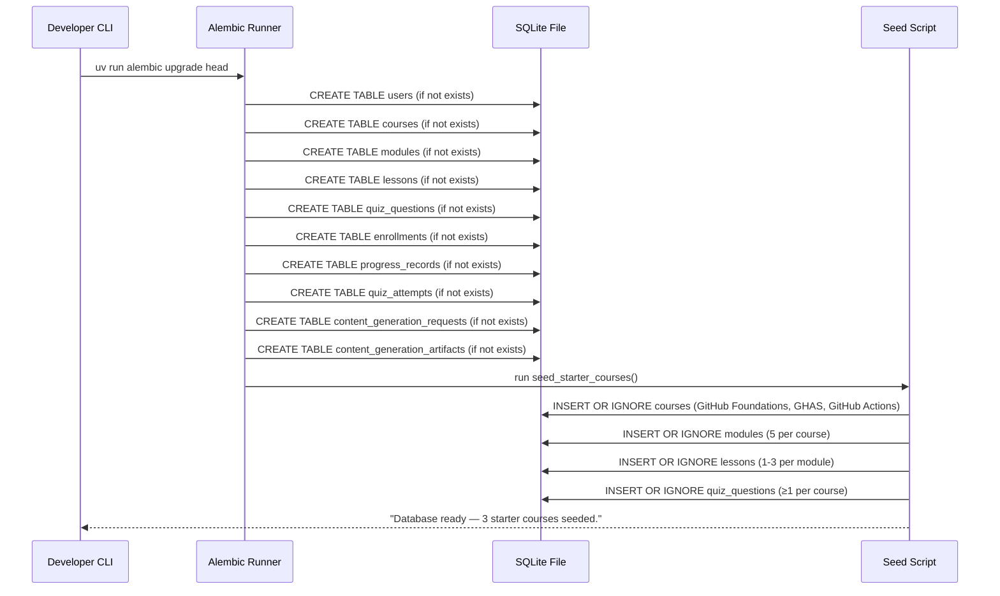
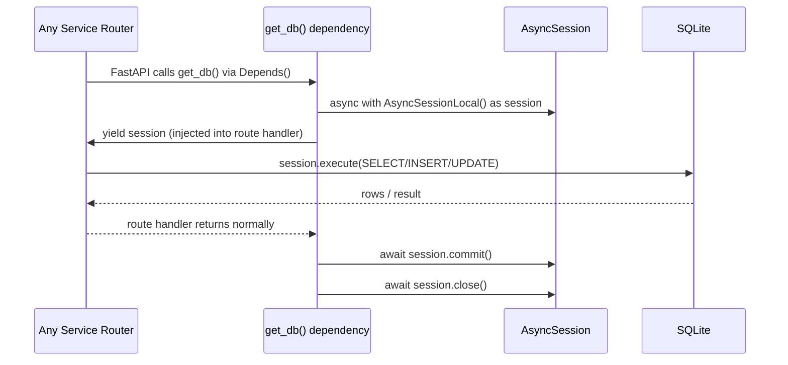

# Data Layer — Low-Level Design (LLD)

| Field                    | Value                                          |
|--------------------------|------------------------------------------------|
| **Title**                | Data Layer — Low-Level Design                  |
| **Component**            | Data Layer (SQLite + SQLAlchemy)               |
| **Version**              | 1.0                                            |
| **Date**                 | 2026-03-26                                     |
| **Author**               | 2-plan-and-design-agent                        |
| **HLD Component Ref**    | COMP-006                                       |

---

## 1. Component Purpose & Scope

### 1.1 Purpose

The Data Layer is the persistence foundation of the entire Learning Platform. It owns the canonical database schema for all ten domain entities, the SQLAlchemy ORM model definitions, the async session lifecycle, Alembic migration scripts, and the database seed script that pre-populates the three mandatory starter courses on first launch. Every other service component accesses the database exclusively through an injected `AsyncSession` provided by this layer.

This component satisfies BRD-FR-041, BRD-FR-042, BRD-FR-043, BRD-FR-044, and BRD-NFR-003.

### 1.2 Scope

- **Responsible for**: SQLAlchemy ORM model definitions for all 10 entities, `AsyncSession` factory and lifecycle management (via FastAPI `Depends()`), Alembic migration scripts, the `seed_starter_courses()` idempotent script, and database connection configuration via `pydantic-settings`.
- **Not responsible for**: Business logic (owned by each service), API routing (COMP-001 through COMP-005), or Markdown sanitisation (COMP-002 / COMP-003).
- **Interfaces with**: All service components (COMP-001 through COMP-005) receive an `AsyncSession` via the `get_db()` dependency.

---

## 2. Detailed Design

### 2.1 Module / Class Structure

```
src/
└── database/
    ├── __init__.py
    ├── base.py            # SQLAlchemy declarative_base, metadata
    ├── engine.py          # create_async_engine() + AsyncSession factory
    ├── session.py         # get_db() FastAPI dependency (AsyncSession lifecycle)
    ├── models/
    │   ├── __init__.py
    │   ├── user.py              # User ORM model
    │   ├── course.py            # Course ORM model
    │   ├── module.py            # Module ORM model
    │   ├── lesson.py            # Lesson ORM model
    │   ├── quiz_question.py     # QuizQuestion ORM model
    │   ├── enrollment.py        # Enrollment ORM model
    │   ├── progress_record.py   # ProgressRecord ORM model
    │   ├── quiz_attempt.py      # QuizAttempt ORM model
    │   ├── generation_request.py # ContentGenerationRequest ORM model
    │   └── generation_artifact.py # ContentGenerationArtifact ORM model
    └── migrations/
        ├── env.py               # Alembic environment configuration
        ├── script.py.mako       # Migration script template
        └── versions/
            ├── 001_initial_schema.py  # Creates all tables
            └── 002_seed_starter_courses.py  # Seeds 3 starter courses
```

### 2.2 Key Classes & Functions

| Class / Function              | File             | Description                                                                                           | Inputs                          | Outputs                              |
|-------------------------------|------------------|-------------------------------------------------------------------------------------------------------|---------------------------------|--------------------------------------|
| `Base`                        | `base.py`        | SQLAlchemy `DeclarativeBase` — all ORM models inherit from this                                       | —                               | Base class                           |
| `create_async_engine()`       | `engine.py`      | Creates the SQLAlchemy async engine from `DATABASE_URL`; configures `aiosqlite` driver                | `settings.DATABASE_URL`         | `AsyncEngine`                        |
| `AsyncSessionLocal`           | `engine.py`      | `async_sessionmaker` factory bound to the async engine                                                | `AsyncEngine`                   | `AsyncSession` factory               |
| `get_db()`                    | `session.py`     | FastAPI dependency that yields an `AsyncSession` and ensures commit/rollback on exit                  | —                               | `AsyncGenerator[AsyncSession, None]` |
| `User`                        | `models/user.py` | SQLAlchemy ORM model for the `users` table                                                            | —                               | ORM model class                      |
| `Course`                      | `models/course.py` | ORM model for `courses` table; `learning_objectives` and `tags` stored as JSON strings (TypeDecorator) | —                              | ORM model class                      |
| `Module`                      | `models/module.py` | ORM model for `modules` table; FK to `courses` with `CASCADE` delete                                 | —                               | ORM model class                      |
| `Lesson`                      | `models/lesson.py` | ORM model for `lessons` table; FK to `modules` with `CASCADE` delete                                 | —                               | ORM model class                      |
| `QuizQuestion`                | `models/quiz_question.py` | ORM model for `quiz_questions`; `options` stored as JSON string                              | —                               | ORM model class                      |
| `Enrollment`                  | `models/enrollment.py` | ORM model for `enrollments`; `UNIQUE(user_id, course_id)` constraint                             | —                               | ORM model class                      |
| `ProgressRecord`              | `models/progress_record.py` | ORM model for `progress_records`; `UNIQUE(user_id, lesson_id)` constraint                  | —                               | ORM model class                      |
| `QuizAttempt`                 | `models/quiz_attempt.py` | ORM model for `quiz_attempts`                                                                   | —                               | ORM model class                      |
| `ContentGenerationRequest`    | `models/generation_request.py` | ORM model for `content_generation_requests`                                              | —                               | ORM model class                      |
| `ContentGenerationArtifact`   | `models/generation_artifact.py` | ORM model for `content_generation_artifacts`                                            | —                               | ORM model class                      |
| `seed_starter_courses()`      | `migrations/versions/002_seed_starter_courses.py` | Idempotent seed: inserts 3 published starter courses if not present | `db: AsyncSession` | `None` |

### 2.3 Design Patterns Used

- **Async session-per-request**: `get_db()` creates a new `AsyncSession` for each HTTP request and yields it; the session is committed on success or rolled back on exception, then closed. This aligns with FastAPI's lifespan model.
- **JSON TypeDecorator**: `learning_objectives`, `tags`, and `options` (QuizQuestion) are Python `list[str]` values stored as JSON strings in SQLite (which lacks native array columns). A custom SQLAlchemy `TypeDecorator` handles serialisation/deserialisation transparently.
- **Idempotent migrations + seed**: Alembic migrations are numbered and idempotent. The seed script uses `INSERT OR IGNORE` so it is safe to run multiple times without duplicating data.
- **Cascade deletes**: `ON DELETE CASCADE` on all FK relationships ensures that deleting a Course automatically removes its Modules, Lessons, QuizQuestions, and Enrollments, maintaining referential integrity without manual cleanup.

---

## 3. Data Models

### 3.1 SQLAlchemy ORM Models (Python)

```python
import json
import uuid
from datetime import datetime
from sqlalchemy import (
    String, Text, Integer, Boolean, DateTime,
    ForeignKey, UniqueConstraint, CheckConstraint, TypeDecorator
)
from sqlalchemy.orm import DeclarativeBase, Mapped, mapped_column, relationship


class Base(DeclarativeBase):
    """Base class for all ORM models."""
    pass


class JSONList(TypeDecorator):
    """
    Stores a Python list as a JSON string in SQLite.
    Transparently serialises on write and deserialises on read.
    """
    impl = Text
    cache_ok = True

    def process_bind_param(self, value, dialect):
        if value is None:
            return "[]"
        return json.dumps(value)

    def process_result_value(self, value, dialect):
        if not value:
            return []
        return json.loads(value)


def _uuid() -> str:
    return str(uuid.uuid4())


class User(Base):
    __tablename__ = "users"
    id: Mapped[str] = mapped_column(String, primary_key=True, default=_uuid)
    name: Mapped[str] = mapped_column(String, nullable=False)
    email: Mapped[str] = mapped_column(String, nullable=False, unique=True)
    password_hash: Mapped[str] = mapped_column(String, nullable=False)
    role: Mapped[str] = mapped_column(String, nullable=False)
    created_at: Mapped[datetime] = mapped_column(DateTime, default=datetime.utcnow)

    __table_args__ = (
        CheckConstraint("role IN ('learner', 'admin')", name="ck_users_role"),
    )


class Course(Base):
    __tablename__ = "courses"
    id: Mapped[str] = mapped_column(String, primary_key=True, default=_uuid)
    title: Mapped[str] = mapped_column(String, nullable=False)
    description: Mapped[str] = mapped_column(Text, nullable=False)
    status: Mapped[str] = mapped_column(String, nullable=False, default="draft")
    difficulty: Mapped[str] = mapped_column(String, nullable=False)
    estimated_duration: Mapped[int] = mapped_column(Integer, nullable=False)
    target_audience: Mapped[str] = mapped_column(Text, nullable=False, default="")
    learning_objectives: Mapped[list] = mapped_column(JSONList, nullable=False, default=list)
    tags: Mapped[list] = mapped_column(JSONList, nullable=False, default=list)
    is_ai_generated: Mapped[bool] = mapped_column(Boolean, nullable=False, default=False)
    created_at: Mapped[datetime] = mapped_column(DateTime, default=datetime.utcnow)
    published_at: Mapped[datetime | None] = mapped_column(DateTime, nullable=True)

    modules: Mapped[list["Module"]] = relationship(
        "Module", back_populates="course",
        cascade="all, delete-orphan",
        order_by="Module.sort_order"
    )

    __table_args__ = (
        CheckConstraint("status IN ('draft', 'published')", name="ck_courses_status"),
        CheckConstraint("difficulty IN ('beginner','intermediate','advanced')", name="ck_courses_difficulty"),
    )


class Module(Base):
    __tablename__ = "modules"
    id: Mapped[str] = mapped_column(String, primary_key=True, default=_uuid)
    course_id: Mapped[str] = mapped_column(String, ForeignKey("courses.id", ondelete="CASCADE"), nullable=False)
    title: Mapped[str] = mapped_column(String, nullable=False)
    summary: Mapped[str] = mapped_column(Text, nullable=False, default="")
    sort_order: Mapped[int] = mapped_column(Integer, nullable=False, default=0)
    quiz_passing_score: Mapped[int] = mapped_column(Integer, nullable=False, default=70)
    is_quiz_informational: Mapped[bool] = mapped_column(Boolean, nullable=False, default=False)
    is_ai_generated: Mapped[bool] = mapped_column(Boolean, nullable=False, default=False)
    created_at: Mapped[datetime] = mapped_column(DateTime, default=datetime.utcnow)

    course: Mapped["Course"] = relationship("Course", back_populates="modules")
    lessons: Mapped[list["Lesson"]] = relationship(
        "Lesson", back_populates="module",
        cascade="all, delete-orphan",
        order_by="Lesson.sort_order"
    )
    quiz_questions: Mapped[list["QuizQuestion"]] = relationship(
        "QuizQuestion", back_populates="module",
        cascade="all, delete-orphan",
        order_by="QuizQuestion.sort_order"
    )


class Lesson(Base):
    __tablename__ = "lessons"
    id: Mapped[str] = mapped_column(String, primary_key=True, default=_uuid)
    module_id: Mapped[str] = mapped_column(String, ForeignKey("modules.id", ondelete="CASCADE"), nullable=False)
    title: Mapped[str] = mapped_column(String, nullable=False)
    markdown_content: Mapped[str] = mapped_column(Text, nullable=False, default="")
    estimated_minutes: Mapped[int] = mapped_column(Integer, nullable=False, default=5)
    sort_order: Mapped[int] = mapped_column(Integer, nullable=False, default=0)
    is_ai_generated: Mapped[bool] = mapped_column(Boolean, nullable=False, default=False)
    created_at: Mapped[datetime] = mapped_column(DateTime, default=datetime.utcnow)

    module: Mapped["Module"] = relationship("Module", back_populates="lessons")


class QuizQuestion(Base):
    __tablename__ = "quiz_questions"
    id: Mapped[str] = mapped_column(String, primary_key=True, default=_uuid)
    module_id: Mapped[str] = mapped_column(String, ForeignKey("modules.id", ondelete="CASCADE"), nullable=False)
    question: Mapped[str] = mapped_column(Text, nullable=False)
    options: Mapped[list] = mapped_column(JSONList, nullable=False)
    correct_answer: Mapped[str] = mapped_column(String, nullable=False)
    explanation: Mapped[str] = mapped_column(Text, nullable=False, default="")
    sort_order: Mapped[int] = mapped_column(Integer, nullable=False, default=0)
    is_ai_generated: Mapped[bool] = mapped_column(Boolean, nullable=False, default=False)
    created_at: Mapped[datetime] = mapped_column(DateTime, default=datetime.utcnow)

    module: Mapped["Module"] = relationship("Module", back_populates="quiz_questions")


class Enrollment(Base):
    __tablename__ = "enrollments"
    id: Mapped[str] = mapped_column(String, primary_key=True, default=_uuid)
    user_id: Mapped[str] = mapped_column(String, ForeignKey("users.id", ondelete="CASCADE"), nullable=False)
    course_id: Mapped[str] = mapped_column(String, ForeignKey("courses.id", ondelete="CASCADE"), nullable=False)
    enrolled_at: Mapped[datetime] = mapped_column(DateTime, default=datetime.utcnow)
    status: Mapped[str] = mapped_column(String, nullable=False, default="not_started")
    completed_at: Mapped[datetime | None] = mapped_column(DateTime, nullable=True)
    last_lesson_id: Mapped[str | None] = mapped_column(String, ForeignKey("lessons.id"), nullable=True)

    __table_args__ = (
        UniqueConstraint("user_id", "course_id", name="uq_enrollments_user_course"),
        CheckConstraint("status IN ('not_started','in_progress','completed')", name="ck_enrollments_status"),
    )


class ProgressRecord(Base):
    __tablename__ = "progress_records"
    id: Mapped[str] = mapped_column(String, primary_key=True, default=_uuid)
    user_id: Mapped[str] = mapped_column(String, ForeignKey("users.id", ondelete="CASCADE"), nullable=False)
    lesson_id: Mapped[str] = mapped_column(String, ForeignKey("lessons.id", ondelete="CASCADE"), nullable=False)
    module_id: Mapped[str] = mapped_column(String, ForeignKey("modules.id", ondelete="CASCADE"), nullable=False)
    completed: Mapped[bool] = mapped_column(Boolean, nullable=False, default=False)
    completed_at: Mapped[datetime | None] = mapped_column(DateTime, nullable=True)
    last_viewed_at: Mapped[datetime] = mapped_column(DateTime, default=datetime.utcnow)

    __table_args__ = (
        UniqueConstraint("user_id", "lesson_id", name="uq_progress_user_lesson"),
    )


class QuizAttempt(Base):
    __tablename__ = "quiz_attempts"
    id: Mapped[str] = mapped_column(String, primary_key=True, default=_uuid)
    user_id: Mapped[str] = mapped_column(String, ForeignKey("users.id", ondelete="CASCADE"), nullable=False)
    quiz_question_id: Mapped[str] = mapped_column(String, ForeignKey("quiz_questions.id", ondelete="CASCADE"), nullable=False)
    selected_answer: Mapped[str] = mapped_column(String, nullable=False)
    is_correct: Mapped[bool] = mapped_column(Boolean, nullable=False, default=False)
    attempted_at: Mapped[datetime] = mapped_column(DateTime, default=datetime.utcnow)


class ContentGenerationRequest(Base):
    __tablename__ = "content_generation_requests"
    id: Mapped[str] = mapped_column(String, primary_key=True, default=_uuid)
    prompt_text: Mapped[str] = mapped_column(Text, nullable=False)
    model_used: Mapped[str] = mapped_column(String, nullable=False, default="gpt-4o")
    requester_id: Mapped[str] = mapped_column(String, ForeignKey("users.id"), nullable=False)
    status: Mapped[str] = mapped_column(String, nullable=False, default="pending")
    template_id: Mapped[str | None] = mapped_column(String, nullable=True)
    section_type: Mapped[str | None] = mapped_column(String, nullable=True)
    section_id: Mapped[str | None] = mapped_column(String, nullable=True)
    created_at: Mapped[datetime] = mapped_column(DateTime, default=datetime.utcnow)
    completed_at: Mapped[datetime | None] = mapped_column(DateTime, nullable=True)
    latency_ms: Mapped[int | None] = mapped_column(Integer, nullable=True)
    error_message: Mapped[str | None] = mapped_column(Text, nullable=True)

    __table_args__ = (
        CheckConstraint("status IN ('pending','in_progress','completed','failed')", name="ck_gen_req_status"),
    )


class ContentGenerationArtifact(Base):
    __tablename__ = "content_generation_artifacts"
    id: Mapped[str] = mapped_column(String, primary_key=True, default=_uuid)
    source_request_id: Mapped[str] = mapped_column(String, ForeignKey("content_generation_requests.id", ondelete="CASCADE"), nullable=False)
    generated_content: Mapped[str] = mapped_column(Text, nullable=False)   # JSON blob
    content_type: Mapped[str] = mapped_column(String, nullable=False)
    linked_course_id: Mapped[str | None] = mapped_column(String, ForeignKey("courses.id"), nullable=True)
    approved_by: Mapped[str | None] = mapped_column(String, ForeignKey("users.id"), nullable=True)
    approved_at: Mapped[datetime | None] = mapped_column(DateTime, nullable=True)
    created_at: Mapped[datetime] = mapped_column(DateTime, default=datetime.utcnow)

    __table_args__ = (
        CheckConstraint("content_type IN ('course','module','lesson','quiz')", name="ck_artifact_content_type"),
    )
```

### 3.2 Database Schema (Complete DDL)

The full DDL is assembled from the schema sections defined in COMP-002 LLD, COMP-004 LLD, and COMP-003 LLD. The definitive source of truth is the SQLAlchemy ORM models above. Alembic generates the DDL automatically via `alembic revision --autogenerate`.

---

## 4. API Specifications

The Data Layer exposes no REST API endpoints. It provides:

1. **`get_db()` dependency** — injected into all route handlers across COMP-001 through COMP-005.
2. **ORM model classes** — imported by service modules for type-safe queries.

```python
# session.py — FastAPI dependency for async DB session
from collections.abc import AsyncGenerator
from sqlalchemy.ext.asyncio import AsyncSession
from src.database.engine import AsyncSessionLocal


async def get_db() -> AsyncGenerator[AsyncSession, None]:
    """
    Yield an async SQLAlchemy session per HTTP request.
    Commits on clean exit; rolls back on exception; always closes.
    """
    async with AsyncSessionLocal() as session:
        try:
            yield session
            await session.commit()
        except Exception:
            await session.rollback()
            raise
        finally:
            await session.close()
```

---

## 5. Sequence Diagrams

### 5.1 Application Startup — DB Initialisation



### 5.2 Request Lifecycle — Session Injection



---

## 6. Error Handling Strategy

### 6.1 Exception Hierarchy

| Exception Class                  | HTTP Status | Description                                                         | Retry? |
|----------------------------------|-------------|---------------------------------------------------------------------|--------|
| `sqlalchemy.exc.IntegrityError`  | 409         | Unique constraint violation (e.g., duplicate email, duplicate enrollment) | No |
| `sqlalchemy.exc.OperationalError`| 500         | DB file locked or unavailable (SQLite concurrency edge case)        | Yes    |
| `sqlalchemy.exc.NoResultFound`   | 404         | `session.scalars().one()` finds no matching row                    | No     |

All `sqlalchemy.exc` exceptions are caught at the service layer and re-raised as typed application exceptions (e.g., `DuplicateEnrollmentError`, `CourseNotFoundError`) so routers return consistent JSON error responses.

### 6.2 Error Response Format

```json
{
    "error": {
        "code": "DATABASE_ERROR",
        "message": "A database error occurred. Please try again.",
        "details": null
    }
}
```

### 6.3 Logging

| Event                              | Level   | Fields Logged                                                  |
|------------------------------------|---------|----------------------------------------------------------------|
| DB session opened                  | DEBUG   | `event=DB_SESSION_OPEN`                                        |
| DB session committed               | DEBUG   | `event=DB_SESSION_COMMIT`                                      |
| DB session rolled back (exception) | WARNING | `event=DB_SESSION_ROLLBACK`, `exceptionType`                   |
| DB OperationalError                | ERROR   | `event=DB_OPERATIONAL_ERROR`, `errorDetail`                    |

---

## 7. Configuration & Environment Variables

| Variable        | Description                                                    | Required | Default                                                  |
|-----------------|----------------------------------------------------------------|----------|----------------------------------------------------------|
| `DATABASE_URL`  | SQLAlchemy async connection URL for the database               | No       | `sqlite+aiosqlite:///./learning_platform.db`             |
| `DB_ECHO`       | Set to `true` to enable SQLAlchemy query logging (development) | No       | `false`                                                  |

---

## 8. Dependencies

### 8.1 Internal Dependencies

The Data Layer has **no** dependencies on other application components. It is a foundational layer that all other components depend on.

### 8.2 External Dependencies

| Package / Service  | Version | Purpose                                                                              |
|--------------------|---------|--------------------------------------------------------------------------------------|
| `sqlalchemy`       | 2.x     | Async ORM, `DeclarativeBase`, `mapped_column`, `relationship`, session management    |
| `aiosqlite`        | 0.20+   | Async SQLite driver required by SQLAlchemy's async engine for SQLite                 |
| `alembic`          | 1.x     | Schema migration management; auto-generates DDL from ORM models                      |
| `pydantic-settings`| 2.x     | Load `DATABASE_URL` and `DB_ECHO` from environment variables                         |

---

## 9. Traceability

| LLD Element                                      | HLD Component | BRD Requirement(s)                                              |
|--------------------------------------------------|---------------|-----------------------------------------------------------------|
| `seed_starter_courses()` — GitHub Foundations    | COMP-006      | BRD-FR-041 (seeded GitHub Foundations course, 5 modules)        |
| `seed_starter_courses()` — GitHub Advanced Security | COMP-006   | BRD-FR-042 (seeded GHAS course, 5 modules)                      |
| `seed_starter_courses()` — GitHub Actions        | COMP-006      | BRD-FR-043 (seeded GitHub Actions course, 5 modules)            |
| Seed constraints (3–5 modules, 1–3 lessons, ≥1 quiz) | COMP-006 | BRD-FR-044 (starter course structure constraints)               |
| SQLite + async session (single file, no server)  | COMP-006      | BRD-NFR-003 (supports ≤ 50 concurrent learners)                 |
| `UniqueConstraint("user_id", "course_id")` on enrollments | COMP-006 | BRD-FR-014 (duplicate enrollment returns 409)                |
| `CheckConstraint` on status/role/difficulty fields | COMP-006    | Multiple FR (field-level validation at DB layer)                |
| `JSONList` TypeDecorator for `options`, `tags`, `learning_objectives` | COMP-006 | BRD-FR-010, BRD-FR-012 (array fields)          |
| `ContentGenerationRequest` + `ContentGenerationArtifact` tables | COMP-006 | BRD-INT-010 (audit metadata for every generation call) |
