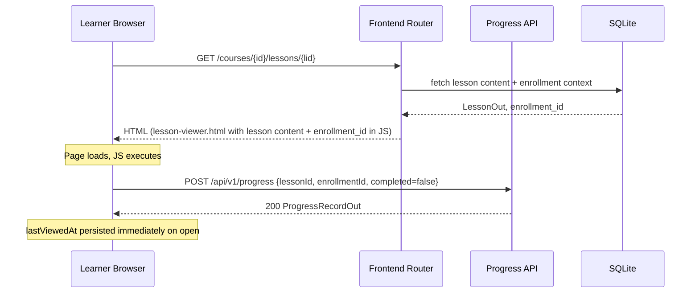
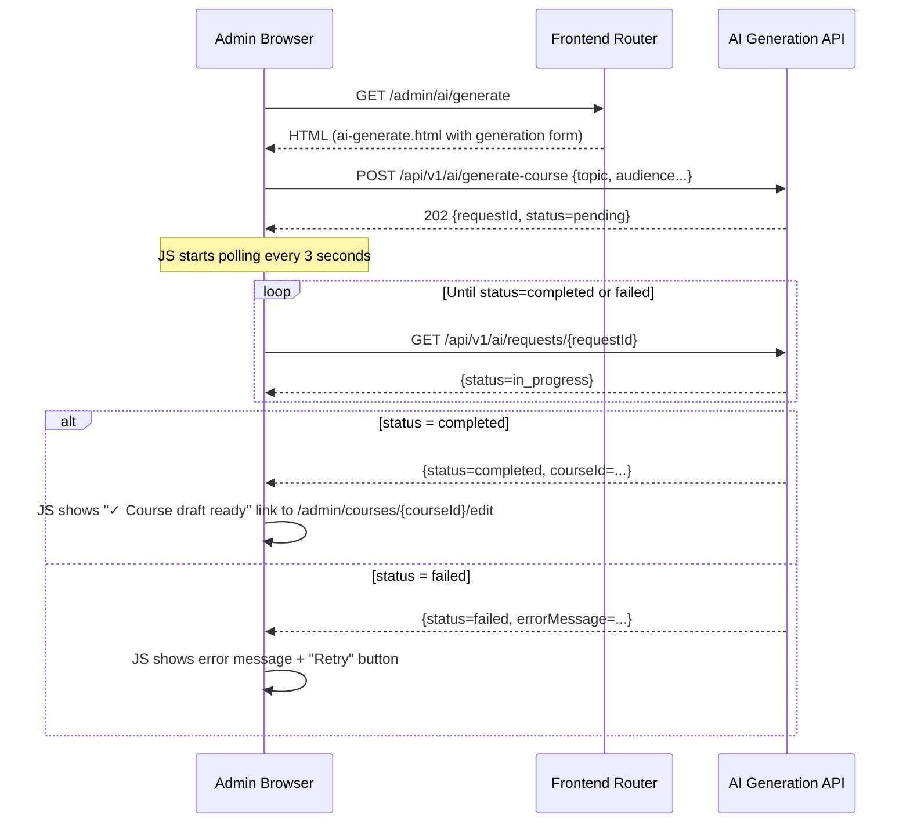
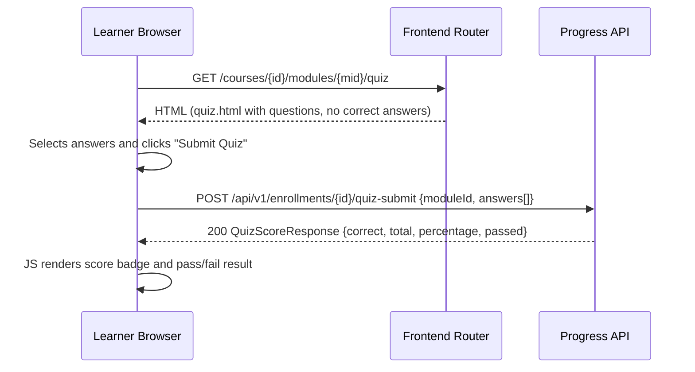

# Frontend — Low-Level Design (LLD)

| Field                    | Value                                          |
|--------------------------|------------------------------------------------|
| **Title**                | Frontend — Low-Level Design                    |
| **Component**            | Frontend (Jinja2 + Vanilla JS)                 |
| **Version**              | 1.0                                            |
| **Date**                 | 2026-03-26                                     |
| **Author**               | 2-plan-and-design-agent                        |
| **HLD Component Ref**    | COMP-007                                       |

---

## 1. Component Purpose & Scope

### 1.1 Purpose

The Frontend component serves the learner and admin user interfaces as server-rendered HTML pages using FastAPI's Jinja2 integration. It handles all page-level routing (non-API routes at root paths), renders initial page data embedded in templates, and uses Vanilla JS `fetch()` calls to handle dynamic interactions (progress updates, quiz submission, AI generation status polling, and admin UI actions) without requiring a frontend framework.

This component satisfies BRD-NFR-008 (≤ 2 clicks to next lesson from dashboard), BRD-NFR-009 (responsive for desktop and tablet), BRD-FR-033 (AI-generated draft label in admin UI), and BRD-FR-035 (admin sees generation error and retry button).

### 1.2 Scope

- **Responsible for**: Page-level route handlers returning `Jinja2TemplateResponse`, HTML/CSS/JS template files, client-side dynamic interactions via Vanilla JS fetch, Markdown rendering with XSS-safe output in lesson viewer, AI generation status polling UI, quiz submission UI, responsive layout (desktop ≥ 1280 px, tablet 768–1279 px).
- **Not responsible for**: API business logic (owned by COMP-001 through COMP-005), authentication validation (COMP-001), database access (COMP-006), Markdown sanitisation on write (COMP-002/COMP-003). The frontend re-sanitises rendered HTML using the `bleach` output baked in by the server — it does not perform client-side sanitisation.
- **Interfaces with**:
  - **COMP-001 (Auth Service)**: login/logout page routes; JWT cookie is set by COMP-001, not the frontend.
  - **COMP-002 (Course Management)**: course catalog, course detail, lesson viewer pages.
  - **COMP-003 (AI Generation)**: admin AI generation form page; JS polls generation status endpoint.
  - **COMP-004 (Progress Tracking)**: JS `fetch()` calls to `/api/v1/progress` on lesson view/completion, quiz submit.
  - **COMP-005 (Reporting)**: admin dashboard page and CSV export trigger.

---

## 2. Detailed Design

### 2.1 Module / Class Structure

```
src/
├── frontend/
│   ├── __init__.py
│   └── router.py              # FastAPI page-route handlers (Jinja2TemplateResponse)
├── static/
│   ├── css/
│   │   ├── base.css            # Global styles, CSS custom properties, reset
│   │   ├── layout.css          # Responsive grid, header, sidebar, main content area
│   │   ├── components.css      # Buttons, cards, badges, progress bars, modals
│   │   ├── learner.css         # Learner-specific styles (dashboard, lesson viewer, quiz)
│   │   └── admin.css           # Admin-specific styles (course editor, generation form, dashboard)
│   └── js/
│       ├── progress.js         # Lesson view/complete API calls; auto-save progress
│       ├── quiz.js             # Quiz form submission; score display
│       ├── ai-generation.js    # Trigger generation, poll status, show progress/error/retry
│       ├── course-editor.js    # Admin course/module/lesson CRUD actions
│       └── utils.js            # Shared fetch wrapper (adds error handling, JSON parsing)
└── templates/
    ├── base.html               # Base template: HTML skeleton, nav, cookie-based auth state
    ├── auth/
    │   └── login.html          # Sign-in form page
    ├── learner/
    │   ├── dashboard.html      # Learner dashboard: enrolled courses, completion progress
    │   ├── catalog.html        # Course catalog with search/filter
    │   ├── course-detail.html  # Course overview, module list, enroll button
    │   ├── lesson-viewer.html  # Lesson content + progress controls + quiz link
    │   └── quiz.html           # Module quiz: MCQ form + score results display
    └── admin/
        ├── dashboard.html      # Admin reporting dashboard with metrics
        ├── course-list.html    # Admin course list with status badges
        ├── course-editor.html  # Create/edit course, manage modules/lessons
        ├── lesson-editor.html  # Markdown editor for a single lesson
        ├── ai-generate.html    # AI generation request form + status polling UI
        └── generation-log.html # ContentGenerationRequest audit log
```

### 2.2 Page Routes

| Method | Path                                      | Auth Required       | Template                         | Description                                                    |
|--------|-------------------------------------------|---------------------|----------------------------------|----------------------------------------------------------------|
| GET    | `/`                                       | None (redirect)     | —                                | Redirect to `/dashboard` or `/login` based on cookie           |
| GET    | `/login`                                  | None                | `auth/login.html`                | Sign-in form                                                   |
| GET    | `/dashboard`                              | Any authenticated   | `learner/dashboard.html` or `admin/dashboard.html` | Role-based dashboard          |
| GET    | `/catalog`                                | Any authenticated   | `learner/catalog.html`           | Published course catalog with filter UI                        |
| GET    | `/courses/{course_id}`                    | Any authenticated   | `learner/course-detail.html`     | Course overview and module list                                |
| GET    | `/courses/{course_id}/lessons/{lesson_id}`| Enrolled learner    | `learner/lesson-viewer.html`     | Lesson content viewer; triggers progress record on load        |
| GET    | `/courses/{course_id}/modules/{module_id}/quiz` | Enrolled learner | `learner/quiz.html`           | Module quiz form                                               |
| GET    | `/admin`                                  | Admin               | `admin/dashboard.html`           | Admin reporting dashboard                                      |
| GET    | `/admin/courses`                          | Admin               | `admin/course-list.html`         | Admin course management list                                   |
| GET    | `/admin/courses/new`                      | Admin               | `admin/course-editor.html`       | New course creation form                                       |
| GET    | `/admin/courses/{course_id}/edit`         | Admin               | `admin/course-editor.html`       | Edit existing course                                           |
| GET    | `/admin/lessons/{lesson_id}/edit`         | Admin               | `admin/lesson-editor.html`       | Edit lesson Markdown content                                   |
| GET    | `/admin/ai/generate`                      | Admin               | `admin/ai-generate.html`         | AI generation request form                                     |
| GET    | `/admin/ai/log`                           | Admin               | `admin/generation-log.html`      | AI generation audit log                                        |

### 2.3 Key Vanilla JS Functions

| Function                     | File                | Description                                                                                 |
|------------------------------|---------------------|---------------------------------------------------------------------------------------------|
| `recordLessonView(lessonId, enrollmentId)` | `progress.js` | Called on lesson page load; POST to `/api/v1/progress` with `completed=false` to persist `lastViewedAt` |
| `markLessonComplete(lessonId, enrollmentId)` | `progress.js` | Called on "Mark Complete" button click; POST to `/api/v1/progress` with `completed=true`  |
| `updateProgressBar(percentage)` | `progress.js` | Updates the CSS progress bar width and ARIA value with the current completion percentage    |
| `submitQuiz(moduleId, enrollmentId, answers)` | `quiz.js` | POST to `/api/v1/enrollments/{id}/quiz-submit`; renders score result or error             |
| `renderQuizResult(scoreResponse)` | `quiz.js`     | Displays correct/total count, percentage, and pass/fail badge after quiz submission        |
| `triggerGeneration(formData)` | `ai-generation.js`  | POST to `/api/v1/ai/generate-course`; stores `requestId`; starts polling                  |
| `pollGenerationStatus(requestId)` | `ai-generation.js` | `setInterval()` calls `GET /api/v1/ai/requests/{id}` every 3 s until completed or failed |
| `renderGenerationError(errorMsg)` | `ai-generation.js` | Displays error message and "Retry" button; clears polling interval                       |
| `apiFetch(path, options)`    | `utils.js`          | Shared wrapper around `fetch()`: adds `credentials: 'include'`, handles 401 redirect to login, parses JSON |

### 2.4 Design Patterns Used

- **Progressive enhancement**: Initial page content is server-rendered by Jinja2 (works without JS). JS enhances with async progress updates, quiz submission, and generation polling.
- **Credentials: 'include' on all fetch calls**: All `apiFetch()` calls include `credentials: 'include'` so the JWT HTTP-only cookie is sent with every JSON API request.
- **HTMX-free**: No HTMX or other enhancement libraries — plain `fetch()` is used for all dynamic interactions to stay within the Vanilla JS constraint.
- **Responsive CSS grid**: A two-column CSS grid layout (sidebar + main content) collapses to a single column below 768 px via a `@media` breakpoint. No CSS framework (no Bootstrap, Tailwind) — custom CSS only.
- **Jinja2 template inheritance**: All pages extend `base.html` which injects the authenticated user's name and role into the nav bar.

---

## 3. Data Models

The Frontend component does not define Pydantic models or database tables. It consumes JSON responses from the API services and renders them via Jinja2 templates.

### 3.1 Jinja2 Template Context Variables

| Template                    | Context Variable         | Type                  | Description                                                       |
|-----------------------------|--------------------------|-----------------------|-------------------------------------------------------------------|
| `base.html`                 | `current_user`           | `UserOut | None`      | Authenticated user injected by the page router; `None` on login page |
| `learner/dashboard.html`    | `enrollments`            | `list[EnrollmentOut]` | Learner's enrolled courses with completion percentages            |
| `learner/catalog.html`      | `courses`                | `list[CourseOut]`     | Published courses; `difficulty_filter`, `tag_filter` for active filter state |
| `learner/lesson-viewer.html`| `lesson`                 | `LessonOut`           | Lesson data (pre-sanitised Markdown content from DB)              |
| `learner/lesson-viewer.html`| `enrollment_id`          | `str`                 | Current enrollment ID (injected for JS progress calls)            |
| `learner/quiz.html`         | `questions`              | `list[QuizQuestionOut]` | Quiz questions (correct answer **excluded**)                    |
| `admin/course-editor.html`  | `course`                 | `CourseOut | None`    | Existing course for edit; `None` for new course                   |
| `admin/ai-generate.html`    | `templates`              | `list[PromptTemplate]`| Available prompt templates for display                            |
| `admin/generation-log.html` | `generation_requests`    | `list[ContentGenerationRequestOut]` | Past generation requests for audit log              |

---

## 4. API Specifications

The Frontend does not define REST API endpoints. Page routes return `TemplateResponse` objects:

```python
# Example page route handler in frontend/router.py
from fastapi import APIRouter, Request, Depends
from fastapi.responses import HTMLResponse
from fastapi.templating import Jinja2Templates
from src.auth.dependencies import require_authenticated_user
from src.auth.models import TokenPayload

router = APIRouter()
templates = Jinja2Templates(directory="src/templates")


@router.get("/catalog", response_class=HTMLResponse)
async def catalog_page(
    request: Request,
    difficulty: str | None = None,
    tag: str | None = None,
    current_user: TokenPayload = Depends(require_authenticated_user),
    db=Depends(get_db),
):
    """Render the course catalog page with published courses."""
    courses = await get_course_catalog(db, difficulty=difficulty, tag=tag)
    return templates.TemplateResponse(
        "learner/catalog.html",
        {
            "request": request,
            "courses": courses,
            "current_user": current_user,
            "difficulty_filter": difficulty,
            "tag_filter": tag,
        },
    )
```

---

## 5. Sequence Diagrams

### 5.1 Lesson View — Auto-Save Progress on Page Load



### 5.2 AI Generation — Admin Submits Request and Polls Status



### 5.3 Quiz Submission Flow



---

## 6. Error Handling Strategy

### 6.1 Client-Side Error Handling

| Scenario                          | Handling                                                                                              |
|-----------------------------------|-------------------------------------------------------------------------------------------------------|
| API returns 401                   | `apiFetch()` redirects browser to `/login`                                                            |
| API returns 403                   | Display user-friendly "You do not have permission" message; no redirect                               |
| API returns 422                   | Display field-level validation errors inline in the form                                              |
| API returns 500                   | Display generic "Something went wrong. Please try again." message                                     |
| Generation status = `failed`      | Display `errorMessage` from API response; show "Retry" button that re-submits the generation form     |
| Network error (fetch exception)   | Display "Network error — please check your connection" message                                        |

### 6.2 Error Response Rendering

All API error responses follow the standard format:

```json
{
    "error": {
        "code": "ERROR_CODE",
        "message": "Human-readable message",
        "details": null
    }
}
```

The `apiFetch()` utility function reads `error.message` from this structure and displays it in a designated `#error-message` DOM element on the relevant page.

### 6.3 Logging

The Frontend component does not generate server-side logs beyond what is produced by the FastAPI page route handlers (which log incoming requests at INFO level via Uvicorn access logging). Client-side errors are surfaced visually to the user; they are not sent to a server logging endpoint in MVP.

---

## 7. Configuration & Environment Variables

The Frontend component does not directly consume environment variables. Configuration relevant to the frontend (such as `ENVIRONMENT` for determining whether to show debug information) is passed via Jinja2 template context by the page route handlers.

| Template context key | Description                                      | Set by                         |
|----------------------|--------------------------------------------------|--------------------------------|
| `environment`        | `development` / `production` for dev-mode UI hints | Page router reads `ENVIRONMENT` env var |

---

## 8. Dependencies

### 8.1 Internal Dependencies

| Component   | Purpose                                                                            | Interface                                                  |
|-------------|------------------------------------------------------------------------------------|------------------------------------------------------------|
| COMP-001    | `require_authenticated_user()` and `require_admin()` gate all page routes          | `Depends()` in page route handlers                         |
| COMP-002    | Course and lesson data for catalog, detail, and lesson-viewer pages                | Service function calls in page handlers                    |
| COMP-003    | AI generation form and status polling                                              | `apiFetch()` calls to `/api/v1/ai/*` in `ai-generation.js` |
| COMP-004    | Progress and quiz data for learner pages; receives fetch POSTs from Vanilla JS    | `apiFetch()` calls to `/api/v1/progress`, `/api/v1/enrollments/*` |
| COMP-005    | Admin dashboard metrics for `/admin` page                                          | Service function call in admin dashboard page handler      |

### 8.2 External Dependencies

| Package / Service  | Version | Purpose                                                                        |
|--------------------|---------|--------------------------------------------------------------------------------|
| `fastapi`          | 0.111+  | `APIRouter`, `Jinja2Templates`, `HTMLResponse`, `Request`                      |
| `jinja2`           | 3.x     | Server-side HTML template rendering                                            |
| `python-multipart` | 0.0.9+  | Required by FastAPI to parse HTML form submissions (login form)                |

---

## 9. UI Component Descriptions

### 9.1 Learner Dashboard (`learner/dashboard.html`)

Displays all enrolled courses as cards with:
- Course title and difficulty badge
- Circular or linear progress bar (CSS-driven, percentage from `EnrollmentOut.completionPercentage`)
- "Continue" button that navigates to the resume endpoint or first lesson if not yet started
- Enrollment status badge (`not_started`, `in_progress`, `completed`)

**2-click requirement (BRD-NFR-008)**: Dashboard → "Continue" → lesson viewer = 2 clicks maximum.

### 9.2 Lesson Viewer (`learner/lesson-viewer.html`)

- Renders sanitised Markdown content as HTML (pre-sanitised by server via bleach)
- Module navigation sidebar: ordered list of lessons with completion checkmarks
- "Mark Complete" button triggers `markLessonComplete()` JS call
- Auto-records `lastViewedAt` on page load via `recordLessonView()` JS call
- Previous / Next lesson navigation links
- "Take Quiz" link at bottom of final lesson in a module

### 9.3 Admin Course Editor (`admin/course-editor.html`)

- Form for course metadata (title, description, difficulty, tags, etc.)
- Expandable accordion for each Module with:
  - Module title and summary
  - Lesson list with edit links
  - "AI-generated draft" badge on any `isAiGenerated=true` section (BRD-FR-033)
  - "Add Lesson", "Add Quiz Question" buttons
- Publish/Unpublish button with confirmation modal

### 9.4 AI Generation Form (`admin/ai-generate.html`)

- Input fields: topic, target audience, learning objectives, difficulty, desired module count, preferred tone
- "Generate Course" submit button
- After submission:
  - Animated spinner shown while `status=in_progress`
  - Success state: link to the generated draft course editor
  - Error state: error message from API + "Retry" button (BRD-FR-035)
- Polling implemented with `setInterval(pollGenerationStatus, 3000)` cleared on terminal status

---

## 10. Traceability

| LLD Element                                            | HLD Component | BRD Requirement(s)                                                    |
|--------------------------------------------------------|---------------|-----------------------------------------------------------------------|
| Dashboard → Continue → lesson viewer (≤ 2 clicks)     | COMP-007      | BRD-NFR-008 (≤ 2 clicks to reach next lesson)                        |
| Responsive CSS (≥ 1280 px, 768–1279 px breakpoints)   | COMP-007      | BRD-NFR-009 (responsive for desktop and tablet)                       |
| "AI-generated draft" badge on `isAiGenerated=true`    | COMP-007      | BRD-FR-033 (label AI-generated content until admin approval)          |
| Generation error message + "Retry" button             | COMP-007      | BRD-FR-035 (admin sees error and retry button on AI failure)          |
| `recordLessonView()` called on lesson page load       | COMP-007      | BRD-FR-021, BRD-NFR-010 (progress saved on page open, not just on explicit save) |
| Quiz form: correct answer excluded from HTML          | COMP-007      | BRD-FR-022, BRD-FR-023 (server-side evaluation; no client-side answer leakage) |
| `credentials: 'include'` on all `apiFetch()` calls    | COMP-007      | BRD-NFR-004 (JWT cookie sent with every authenticated request)        |
