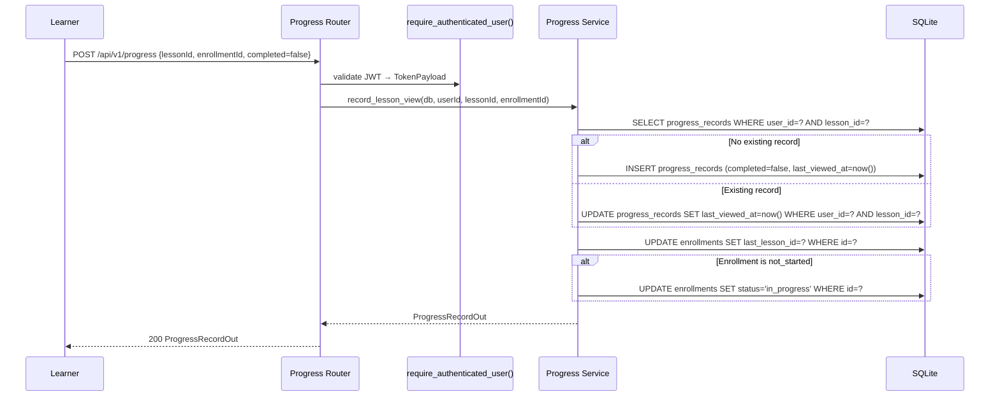
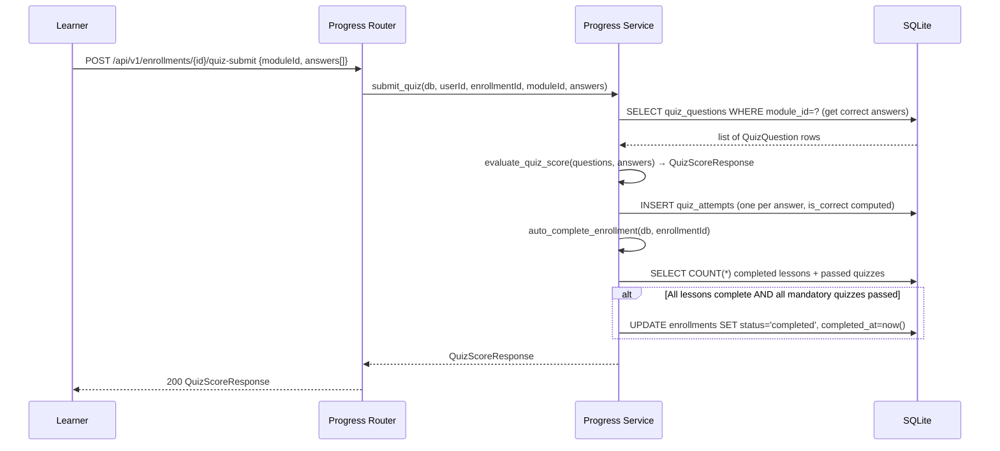
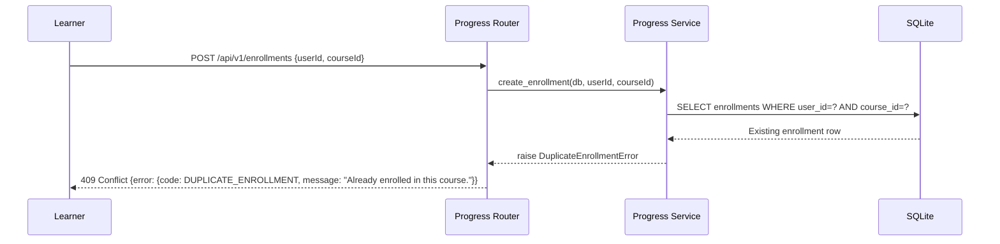

# Progress Tracking Service — Low-Level Design (LLD)

| Field                    | Value                                              |
|--------------------------|----------------------------------------------------|
| **Title**                | Progress Tracking Service — Low-Level Design       |
| **Component**            | Progress Tracking Service                          |
| **Version**              | 1.0                                                |
| **Date**                 | 2026-03-26                                         |
| **Author**               | 2-plan-and-design-agent                            |
| **HLD Component Ref**    | COMP-004                                           |

---

## 1. Component Purpose & Scope

### 1.1 Purpose

The Progress Tracking Service manages the complete learner journey within a course: enrollment creation, lesson-level progress recording, quiz attempt recording and scoring, enrollment status transitions, completion percentage calculation, and course resume support. It satisfies BRD-FR-014 through BRD-FR-025 and BRD-NFR-010.

This service is the write-heavy component of the platform and is designed to be called frequently as learners progress through lessons. Its most critical reliability requirement is that **progress is never lost on page refresh** — `ProgressRecord.lastViewedAt` is written on lesson open (not only on explicit save).

### 1.2 Scope

- **Responsible for**: Enrollment CRUD (admin and self-enrollment), ProgressRecord creation and updates, QuizAttempt recording, server-side quiz correctness evaluation, completion percentage calculation, enrollment status state machine (`not_started` → `in_progress` → `completed`), and resume-lesson endpoint.
- **Not responsible for**: Course content delivery (COMP-002), reporting dashboard aggregation (COMP-005), AI generation (COMP-003), or authentication/RBAC (COMP-001).
- **Interfaces with**:
  - **COMP-001 (Auth Service)**: `require_authenticated_user()`, `require_admin()`, and `require_own_data()` gate all endpoints.
  - **COMP-002 (Course Management)**: reads `lessons`, `modules`, `quiz_questions`, and `courses` tables to validate IDs and determine total lesson/quiz counts for completion calculations.
  - **COMP-006 (Data Layer)**: reads/writes `enrollments`, `progress_records`, and `quiz_attempts` tables.

---

## 2. Detailed Design

### 2.1 Module / Class Structure

```
src/
└── progress_tracking/
    ├── __init__.py
    ├── router.py          # FastAPI routes: /api/v1/enrollments/*, /api/v1/progress/*, /api/v1/quiz-attempts/*
    ├── service.py         # Business logic: enrollment, progress, quiz scoring, completion
    ├── models.py          # Pydantic request/response schemas
    ├── dependencies.py    # Shared Depends() helpers (get_enrollment_or_404, assert_enrolled)
    └── exceptions.py      # EnrollmentNotFoundError, DuplicateEnrollmentError, QuizAttemptError
```

### 2.2 Key Classes & Functions

| Class / Function                      | File             | Description                                                                                               | Inputs                                                        | Outputs                            |
|---------------------------------------|------------------|-----------------------------------------------------------------------------------------------------------|---------------------------------------------------------------|------------------------------------|
| `EnrollmentCreate`                    | `models.py`      | Pydantic model for POST /api/v1/enrollments body                                                          | `userId, courseId`                                            | Validated enrollment payload       |
| `EnrollmentOut`                       | `models.py`      | Pydantic model for enrollment responses including completionPercentage                                    | ORM Enrollment row                                            | Serialised enrollment              |
| `ProgressRecordCreate`                | `models.py`      | Pydantic model for POST /api/v1/progress (mark lesson viewed/complete)                                    | `lessonId, completed: bool`                                   | Validated progress payload         |
| `QuizSubmission`                      | `models.py`      | Pydantic model for POST /api/v1/enrollments/{id}/quiz-submit body                                         | `moduleId, answers: list[QuizAnswer]`                         | Validated submission               |
| `QuizScoreResponse`                   | `models.py`      | Pydantic model for quiz submission response                                                               | `correct, total, percentage, passed`                          | Score summary                      |
| `create_enrollment()`                 | `service.py`     | Creates Enrollment with `status=not_started`; raises `DuplicateEnrollmentError` if already enrolled       | `db, userId, courseId, created_by`                            | `EnrollmentOut`                    |
| `get_enrollment()`                    | `service.py`     | Retrieves enrollment by ID with completionPercentage                                                      | `db, enrollment_id`                                           | `EnrollmentOut`                    |
| `record_lesson_view()`                | `service.py`     | Upserts ProgressRecord with `lastViewedAt=now()`; transitions enrollment to `in_progress` if first lesson | `db, userId, lessonId, enrollment_id`                         | `ProgressRecord` ORM               |
| `mark_lesson_complete()`              | `service.py`     | Updates ProgressRecord with `completed=True, completedAt=now()`; recalculates completion percentage       | `db, userId, lessonId, enrollment_id`                         | `EnrollmentOut`                    |
| `calculate_completion_percentage()`   | `service.py`     | Queries total required lessons vs completed lessons; returns integer 0–100                                | `db, enrollment_id`                                           | `int`                              |
| `auto_complete_enrollment()`          | `service.py`     | Called after every lesson/quiz completion; transitions enrollment to `completed` if all items are done     | `db, enrollment_id`                                           | `bool` (was completed)             |
| `get_resume_lesson()`                 | `service.py`     | Returns the lessonId of the last-accessed lesson for the enrollment                                       | `db, enrollment_id`                                           | `str | None` (lessonId)            |
| `submit_quiz()`                       | `service.py`     | Records QuizAttempts, evaluates correctness server-side, returns score summary                            | `db, userId, enrollment_id, moduleId, answers: list[QuizAnswer]` | `QuizScoreResponse`             |
| `evaluate_quiz_score()`               | `service.py`     | Computes correct count, percentage; applies `quizPassingScore` threshold                                  | `questions: list[QuizQuestion]`, `answers: list[QuizAnswer]`  | `QuizScoreResponse`                |

### 2.3 Design Patterns Used

- **State machine for enrollment status**: `not_started` → `in_progress` → `completed`. Transitions are enforced by service logic, not DB constraints, to allow application-layer logging.
- **Upsert pattern for ProgressRecords**: `record_lesson_view()` uses a SQLAlchemy `INSERT OR REPLACE` (SQLite upsert) to ensure progress is persisted idempotently, even on rapid re-opens.
- **Server-side quiz evaluation**: correctness is computed in `evaluate_quiz_score()` by comparing `selectedAnswer` to `correctAnswer` from the DB — never trusting client input for pass/fail.
- **Dependency injection**: `get_enrollment_or_404()` and `assert_enrolled()` are reusable dependencies that centralise enrollment validation logic.

---

## 3. Data Models

### 3.1 Pydantic Models

```python
from pydantic import BaseModel, Field
from typing import Literal, Optional
from datetime import datetime


class EnrollmentCreate(BaseModel):
    """Request body for creating an enrollment (admin or self-enrollment)."""
    user_id: str
    course_id: str


class EnrollmentOut(BaseModel):
    """Enrollment API response including calculated completion percentage."""
    id: str
    user_id: str
    course_id: str
    enrolled_at: datetime
    status: Literal["not_started", "in_progress", "completed"]
    completed_at: Optional[datetime] = None
    last_lesson_id: Optional[str] = None
    completion_percentage: int = Field(ge=0, le=100)

    model_config = {"from_attributes": True}


class ProgressRecordCreate(BaseModel):
    """Request body for recording lesson progress (view or completion)."""
    lesson_id: str
    enrollment_id: str
    completed: bool = False


class ProgressRecordOut(BaseModel):
    """ProgressRecord API response."""
    id: str
    user_id: str
    lesson_id: str
    module_id: str
    completed: bool
    completed_at: Optional[datetime] = None
    last_viewed_at: datetime

    model_config = {"from_attributes": True}


class QuizAnswer(BaseModel):
    """A single answer to one quiz question."""
    quiz_question_id: str
    selected_answer: str


class QuizSubmission(BaseModel):
    """Request body for submitting quiz answers for a module."""
    module_id: str
    enrollment_id: str
    answers: list[QuizAnswer] = Field(min_length=1)


class QuizScoreResponse(BaseModel):
    """Response after quiz submission — always computed server-side."""
    module_id: str
    correct: int
    total: int
    percentage: int = Field(ge=0, le=100)
    passed: bool
    is_informational: bool


class QuizAttemptOut(BaseModel):
    """QuizAttempt API response (is_correct computed server-side)."""
    id: str
    user_id: str
    quiz_question_id: str
    selected_answer: str
    is_correct: bool
    attempted_at: datetime

    model_config = {"from_attributes": True}


class ResumeResponse(BaseModel):
    """Response for the resume endpoint — returns last-accessed lesson."""
    enrollment_id: str
    last_lesson_id: Optional[str] = None
    course_id: str
```

### 3.2 Database Schema

```sql
CREATE TABLE enrollments (
    id              TEXT PRIMARY KEY,                 -- UUID v4
    user_id         TEXT NOT NULL REFERENCES users(id) ON DELETE CASCADE,
    course_id       TEXT NOT NULL REFERENCES courses(id) ON DELETE CASCADE,
    enrolled_at     TIMESTAMP NOT NULL DEFAULT CURRENT_TIMESTAMP,
    status          TEXT NOT NULL DEFAULT 'not_started'
                        CHECK(status IN ('not_started','in_progress','completed')),
    completed_at    TIMESTAMP,
    last_lesson_id  TEXT REFERENCES lessons(id),      -- For resume feature
    UNIQUE(user_id, course_id)                         -- Prevent duplicate enrollment
);

CREATE TABLE progress_records (
    id              TEXT PRIMARY KEY,                 -- UUID v4
    user_id         TEXT NOT NULL REFERENCES users(id) ON DELETE CASCADE,
    lesson_id       TEXT NOT NULL REFERENCES lessons(id) ON DELETE CASCADE,
    module_id       TEXT NOT NULL REFERENCES modules(id) ON DELETE CASCADE,
    completed       INTEGER NOT NULL DEFAULT 0,        -- boolean
    completed_at    TIMESTAMP,
    last_viewed_at  TIMESTAMP NOT NULL DEFAULT CURRENT_TIMESTAMP,
    UNIQUE(user_id, lesson_id)                         -- One record per user/lesson
);

CREATE TABLE quiz_attempts (
    id                TEXT PRIMARY KEY,               -- UUID v4
    user_id           TEXT NOT NULL REFERENCES users(id) ON DELETE CASCADE,
    quiz_question_id  TEXT NOT NULL REFERENCES quiz_questions(id) ON DELETE CASCADE,
    selected_answer   TEXT NOT NULL,
    is_correct        INTEGER NOT NULL DEFAULT 0,      -- computed server-side
    attempted_at      TIMESTAMP NOT NULL DEFAULT CURRENT_TIMESTAMP
);

CREATE INDEX idx_enrollments_user     ON enrollments(user_id);
CREATE INDEX idx_enrollments_course   ON enrollments(course_id);
CREATE INDEX idx_progress_user_lesson ON progress_records(user_id, lesson_id);
CREATE INDEX idx_progress_user        ON progress_records(user_id);
CREATE INDEX idx_quiz_attempts_user   ON quiz_attempts(user_id);
CREATE INDEX idx_quiz_attempts_question ON quiz_attempts(quiz_question_id);
```

---

## 4. API Specifications

### 4.1 Endpoints

| Method | Path                                           | Auth                      | Description                                                            | Request Body          | Response Body           | Status Codes       |
|--------|------------------------------------------------|---------------------------|------------------------------------------------------------------------|-----------------------|-------------------------|--------------------|
| POST   | `/api/v1/enrollments`                          | Admin or own Learner      | Create enrollment (admin: any user; learner: self only, published course) | `EnrollmentCreate`   | `EnrollmentOut`         | 201, 409, 404, 422 |
| GET    | `/api/v1/enrollments`                          | Admin (all) / Learner (own) | List enrollments; learner sees own only                               | —                     | `list[EnrollmentOut]`   | 200                |
| GET    | `/api/v1/enrollments/{enrollment_id}`          | Own user or Admin         | Get single enrollment with completionPercentage                         | —                     | `EnrollmentOut`         | 200, 404           |
| GET    | `/api/v1/enrollments/{enrollment_id}/resume`   | Own learner               | Get last-accessed lesson ID for course resume                           | —                     | `ResumeResponse`        | 200, 404           |
| POST   | `/api/v1/progress`                             | Own learner               | Record lesson view or mark lesson complete                              | `ProgressRecordCreate`| `ProgressRecordOut`     | 200, 201, 404, 422 |
| GET    | `/api/v1/progress/{user_id}`                   | Own user or Admin         | Get all progress records for a user                                     | —                     | `list[ProgressRecordOut]` | 200, 403         |
| POST   | `/api/v1/enrollments/{enrollment_id}/quiz-submit` | Own learner            | Submit quiz answers; returns score summary                              | `QuizSubmission`      | `QuizScoreResponse`     | 200, 404, 422      |
| GET    | `/api/v1/quiz-attempts/{user_id}`              | Own user or Admin         | Get quiz attempt history for a user                                     | —                     | `list[QuizAttemptOut]`  | 200, 403           |

### 4.2 Request / Response Examples

```json
// POST /api/v1/progress (learner marks a lesson as complete)
{
    "lesson_id": "lesson-uuid-001",
    "enrollment_id": "enrollment-uuid-001",
    "completed": true
}
```

```json
// 200 OK — lesson marked complete, completion percentage updated
{
    "id": "progress-record-uuid-001",
    "user_id": "user-uuid-001",
    "lesson_id": "lesson-uuid-001",
    "module_id": "module-uuid-001",
    "completed": true,
    "completed_at": "2026-03-26T14:00:00Z",
    "last_viewed_at": "2026-03-26T14:00:00Z"
}
```

```json
// POST /api/v1/enrollments/{id}/quiz-submit
{
    "module_id": "module-uuid-001",
    "enrollment_id": "enrollment-uuid-001",
    "answers": [
        {"quiz_question_id": "qq-001", "selected_answer": "A pull request"},
        {"quiz_question_id": "qq-002", "selected_answer": "git commit"}
    ]
}
```

```json
// 200 OK — quiz scored server-side
{
    "module_id": "module-uuid-001",
    "correct": 2,
    "total": 2,
    "percentage": 100,
    "passed": true,
    "is_informational": false
}
```

---

## 5. Sequence Diagrams

### 5.1 Primary Flow — Lesson View and Auto-Save Progress



### 5.2 Primary Flow — Quiz Submission and Enrollment Completion



### 5.3 Error Flow — Duplicate Enrollment



---

## 6. Error Handling Strategy

### 6.1 Exception Hierarchy

| Exception Class              | HTTP Status | Description                                                                   | Retry? |
|------------------------------|-------------|-------------------------------------------------------------------------------|--------|
| `EnrollmentNotFoundError`    | 404         | Enrollment ID not found or user doesn't own it                                | No     |
| `DuplicateEnrollmentError`   | 409         | User is already enrolled in the specified course                              | No     |
| `CourseNotPublishedError`    | 404         | Learner self-enrollment attempt on an unpublished course                      | No     |
| `LessonNotFoundError`        | 404         | Lesson ID not found when recording progress                                   | No     |
| `QuizQuestionNotFoundError`  | 404         | Quiz question ID not found during submission                                  | No     |
| `OwnDataViolationError`      | 403         | Learner attempting to record progress for another user                        | No     |
| `ValidationError` (Pydantic) | 422         | Request body fails validation (e.g., empty answers list)                      | No     |

### 6.2 Error Response Format

```json
{
    "error": {
        "code": "DUPLICATE_ENROLLMENT",
        "message": "You are already enrolled in this course.",
        "details": null
    }
}
```

### 6.3 Logging

| Event                                  | Level   | Fields Logged                                                        |
|----------------------------------------|---------|----------------------------------------------------------------------|
| Enrollment created                     | INFO    | `event=ENROLLMENT_CREATED`, `enrollmentId`, `userId`, `courseId`, `createdBy` |
| Lesson viewed (progress recorded)      | DEBUG   | `event=LESSON_VIEWED`, `userId`, `lessonId`, `enrollmentId`         |
| Lesson marked complete                 | INFO    | `event=LESSON_COMPLETED`, `userId`, `lessonId`, `enrollmentId`      |
| Enrollment status transition           | INFO    | `event=ENROLLMENT_STATUS_CHANGE`, `enrollmentId`, `from`, `to`      |
| Quiz submitted                         | INFO    | `event=QUIZ_SUBMITTED`, `userId`, `moduleId`, `correct`, `total`, `passed` |
| Duplicate enrollment attempt           | WARNING | `event=DUPLICATE_ENROLLMENT_ATTEMPT`, `userId`, `courseId`          |

---

## 7. Configuration & Environment Variables

| Variable        | Description                                    | Required | Default |
|-----------------|------------------------------------------------|----------|---------|
| `DATABASE_URL`  | SQLAlchemy async database URL                  | No       | `sqlite+aiosqlite:///./learning_platform.db` |

---

## 8. Dependencies

### 8.1 Internal Dependencies

| Component   | Purpose                                                                                      | Interface                                       |
|-------------|----------------------------------------------------------------------------------------------|-------------------------------------------------|
| COMP-001    | `require_authenticated_user()`, `require_admin()`, `require_own_data()` for endpoint gating  | `Depends()` in router definitions               |
| COMP-002    | Read `lessons`, `modules`, `quiz_questions`, `courses` tables to validate IDs and counts     | Direct SQLAlchemy queries in `service.py`       |
| COMP-006    | Read/write `enrollments`, `progress_records`, `quiz_attempts`                                | `AsyncSession` via `Depends(get_db)`            |

### 8.2 External Dependencies

| Package / Service | Version | Purpose                                                              |
|-------------------|---------|----------------------------------------------------------------------|
| `fastapi`         | 0.111+  | Router, `Depends()`, `HTTPException`                                 |
| `sqlalchemy`      | 2.x     | ORM queries and upsert for progress records                          |
| `pydantic`        | 2.x     | Request/response validation for all progress and quiz models         |

---

## 9. Traceability

| LLD Element                                        | HLD Component | BRD Requirement(s)                                                       |
|----------------------------------------------------|---------------|--------------------------------------------------------------------------|
| `POST /api/v1/enrollments` (admin creates)         | COMP-004      | BRD-FR-014 (admin enrollment, status=not_started)                        |
| `POST /api/v1/enrollments` (learner self-enrolls)  | COMP-004      | BRD-FR-015 (self-enrollment in published course)                         |
| Enrollment state machine (not_started→in_progress→completed) | COMP-004 | BRD-FR-016 (enrollment status states)                              |
| `record_lesson_view()` UPSERT with `lastViewedAt`  | COMP-004      | BRD-FR-017, BRD-NFR-010 (progress persisted on lesson open)              |
| `GET /api/v1/enrollments/{id}/resume`              | COMP-004      | BRD-FR-018 (resume from last-accessed lesson)                            |
| `calculate_completion_percentage()` (0–100)        | COMP-004      | BRD-FR-019 (completion percentage calculation)                           |
| `auto_complete_enrollment()`                       | COMP-004      | BRD-FR-020 (auto-mark enrollment as completed)                           |
| Upsert on lesson open (not only on save)           | COMP-004      | BRD-FR-021 (progress not lost on page refresh)                           |
| `QuizQuestionCreate.options` validator (2–5)       | COMP-004      | BRD-FR-022 (2–5 options, one correct answer, explanation)                |
| `QuizAttempt` INSERT with `is_correct` server-side | COMP-004      | BRD-FR-023 (quiz attempt recorded, is_correct computed server-side)      |
| `QuizScoreResponse` (correct, total, %, passed)    | COMP-004      | BRD-FR-024 (score summary returned after quiz submission)                |
| `quizPassingScore` + `isQuizInformational`         | COMP-004      | BRD-FR-025 (configurable passing threshold per quiz)                     |
