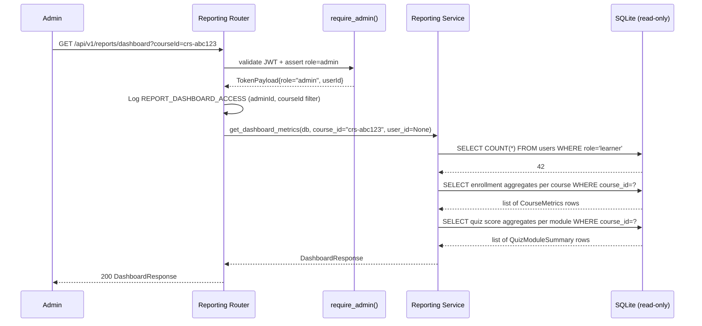
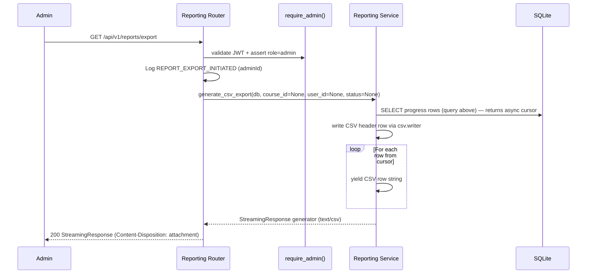
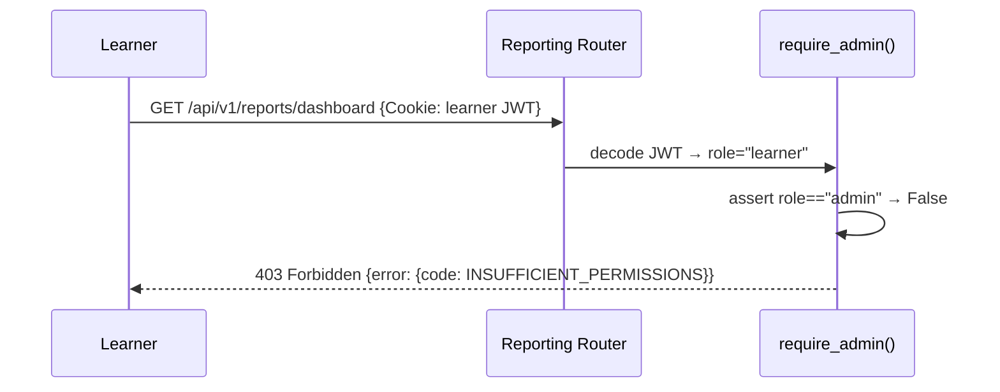

# Reporting Service — Low-Level Design (LLD)

| Field                    | Value                                          |
|--------------------------|------------------------------------------------|
| **Title**                | Reporting Service — Low-Level Design           |
| **Component**            | Reporting Service                              |
| **Version**              | 1.0                                            |
| **Date**                 | 2026-03-26                                     |
| **Author**               | 2-plan-and-design-agent                        |
| **HLD Component Ref**    | COMP-005                                       |

---

## 1. Component Purpose & Scope

### 1.1 Purpose

The Reporting Service provides aggregated metrics and data export capabilities exclusively for Admin users. It surfaces the information admins need to evaluate training effectiveness: total learner count, enrollments per course, completion rates, in-progress counts, quiz performance summaries, and filterable progress data with CSV export. It satisfies BRD-FR-026, BRD-FR-027, BRD-FR-028, BRD-NFR-001, BRD-NFR-013, BRD-NFR-014, and BRD-NFR-015.

All reporting endpoints are Admin-only (BRD-FR-003). Query actions are logged with the requesting admin's userId to satisfy BRD-NFR-015.

### 1.2 Scope

- **Responsible for**: Admin dashboard metrics aggregation (enrollment counts, completion rates, quiz score summaries, in-progress counts), per-course and per-user filtering, CSV export of learner progress data, and reporting action audit logging.
- **Not responsible for**: Real-time analytics, AI generation metrics (COMP-003), learner-facing progress display (COMP-004), or course content management (COMP-002).
- **Interfaces with**:
  - **COMP-001 (Auth Service)**: `require_admin()` gates all reporting endpoints.
  - **COMP-006 (Data Layer)**: runs aggregate queries across `enrollments`, `progress_records`, `quiz_attempts`, `users`, and `courses` tables.

---

## 2. Detailed Design

### 2.1 Module / Class Structure

```
src/
└── reporting/
    ├── __init__.py
    ├── router.py          # FastAPI routes: /api/v1/reports/*
    ├── service.py         # Business logic: aggregation queries, CSV generation
    ├── models.py          # Pydantic response schemas for dashboard and export
    └── exceptions.py      # ReportGenerationError
```

### 2.2 Key Classes & Functions

| Class / Function               | File          | Description                                                                                          | Inputs                                              | Outputs                           |
|--------------------------------|---------------|------------------------------------------------------------------------------------------------------|-----------------------------------------------------|-----------------------------------|
| `DashboardResponse`            | `models.py`   | Pydantic model for GET /api/v1/reports/dashboard response                                            | Aggregated metrics                                  | Dashboard JSON payload            |
| `CourseMetrics`                | `models.py`   | Nested metrics for a single course: enrollment count, completed count, in-progress count, avg quiz   | Course-level aggregations                           | Course metrics sub-object         |
| `LearnerProgressRow`           | `models.py`   | Single row model for CSV export response                                                             | `userId, userName, courseId, courseTitle, enrollmentStatus, completionPercentage, lastActivity` | CSV row |
| `get_dashboard_metrics()`      | `service.py`  | Runs aggregation SQL across enrollments, progress, and quiz_attempts tables; applies optional filters | `db`, `course_id: str | None`, `user_id: str | None` | `DashboardResponse`              |
| `get_per_course_metrics()`     | `service.py`  | Aggregates enrollment count, completion rate, in-progress count, and avg quiz score per course        | `db`, `course_id: str | None`                        | `list[CourseMetrics]`            |
| `get_quiz_score_summary()`     | `service.py`  | Aggregates average quiz score and pass/fail counts per module across all learners                     | `db`, `course_id: str | None`                        | `list[QuizModuleSummary]`        |
| `generate_csv_export()`        | `service.py`  | Queries progress data rows, formats as CSV using Python `csv.writer`, returns StreamingResponse       | `db`, `course_id: str | None`, `user_id: str | None`, `status_filter: str | None` | `StreamingResponse` (text/csv) |

### 2.3 Design Patterns Used

- **Read-only service**: Reporting service never writes data; it only issues `SELECT` queries. This ensures zero write contention and consistent SQLite read performance.
- **Dependency injection**: All queries use an injected `AsyncSession`; no direct DB access in router handlers.
- **Streaming CSV response**: Uses FastAPI `StreamingResponse` with a Python generator to avoid buffering the entire export in memory (important for larger datasets).
- **Optional filter parameters**: `course_id` and `user_id` query parameters are optional; when absent, all data is returned. This provides flexible filtering per BRD-FR-027.

---

## 3. Data Models

### 3.1 Pydantic Models

```python
from pydantic import BaseModel, Field
from typing import Optional
from datetime import datetime


class QuizModuleSummary(BaseModel):
    """Quiz performance summary for one module."""
    module_id: str
    module_title: str
    course_id: str
    total_attempts: int
    average_score: float = Field(ge=0, le=100)
    pass_count: int
    fail_count: int


class CourseMetrics(BaseModel):
    """Enrollment and completion metrics for one course."""
    course_id: str
    course_title: str
    total_enrollments: int
    completed_count: int
    in_progress_count: int
    not_started_count: int
    completion_rate: float = Field(ge=0, le=100)    # percentage
    avg_quiz_score: Optional[float] = None          # None if no quiz attempts


class LearnerSummary(BaseModel):
    """High-level per-learner enrollment summary."""
    user_id: str
    user_name: str
    user_email: str
    total_enrollments: int
    completed_enrollments: int
    in_progress_enrollments: int


class DashboardResponse(BaseModel):
    """
    Admin dashboard response containing all key platform metrics.
    Supports optional filtering by courseId and userId.
    """
    total_learners: int
    total_enrollments: int
    total_completions: int
    overall_completion_rate: float = Field(ge=0, le=100)
    courses: list[CourseMetrics]
    quiz_summaries: list[QuizModuleSummary]
    learner_summaries: list[LearnerSummary]
    generated_at: datetime


class LearnerProgressRow(BaseModel):
    """
    A single row in the CSV export.
    Maps to CSV columns: userId, userName, courseId, courseTitle,
    enrollmentStatus, completionPercentage, lastActivity.
    """
    user_id: str
    user_name: str
    course_id: str
    course_title: str
    enrollment_status: str
    completion_percentage: int
    last_activity: Optional[datetime] = None
```

### 3.2 Database Schema

The Reporting Service does **not** own any tables. It issues read-only aggregate queries against tables owned by other components:

- `users` (COMP-006 / owned by COMP-001)
- `courses` (COMP-006 / owned by COMP-002)
- `enrollments` (COMP-006 / owned by COMP-004)
- `progress_records` (COMP-006 / owned by COMP-004)
- `quiz_attempts` (COMP-006 / owned by COMP-004)

Representative aggregation queries used by the service:

```sql
-- Total learner count
SELECT COUNT(*) FROM users WHERE role = 'learner';

-- Enrollments per course with completion stats (filterable by course_id)
SELECT
    c.id                                                     AS course_id,
    c.title                                                  AS course_title,
    COUNT(e.id)                                              AS total_enrollments,
    SUM(CASE WHEN e.status = 'completed'   THEN 1 ELSE 0 END) AS completed_count,
    SUM(CASE WHEN e.status = 'in_progress' THEN 1 ELSE 0 END) AS in_progress_count,
    SUM(CASE WHEN e.status = 'not_started' THEN 1 ELSE 0 END) AS not_started_count,
    ROUND(
        100.0 * SUM(CASE WHEN e.status = 'completed' THEN 1 ELSE 0 END) / COUNT(e.id),
        1
    )                                                        AS completion_rate
FROM courses c
LEFT JOIN enrollments e ON e.course_id = c.id
WHERE c.status = 'published'
  AND (:course_id IS NULL OR c.id = :course_id)
GROUP BY c.id, c.title;

-- Quiz score summary per module
SELECT
    m.id                  AS module_id,
    m.title               AS module_title,
    m.course_id,
    COUNT(qa.id)          AS total_attempts,
    ROUND(AVG(qa.is_correct) * 100, 1) AS average_score,
    SUM(qa.is_correct)    AS pass_count,
    COUNT(qa.id) - SUM(qa.is_correct) AS fail_count
FROM quiz_attempts qa
JOIN quiz_questions qq ON qa.quiz_question_id = qq.id
JOIN modules m         ON qq.module_id = m.id
WHERE (:course_id IS NULL OR m.course_id = :course_id)
  AND (:user_id IS NULL OR qa.user_id = :user_id)
GROUP BY m.id, m.title, m.course_id;

-- CSV export rows (filterable by course_id, user_id, status)
SELECT
    u.id                  AS user_id,
    u.name                AS user_name,
    c.id                  AS course_id,
    c.title               AS course_title,
    e.status              AS enrollment_status,
    e.completion_percentage,
    MAX(pr.last_viewed_at) AS last_activity
FROM enrollments e
JOIN users  u  ON e.user_id   = u.id
JOIN courses c ON e.course_id = c.id
LEFT JOIN progress_records pr ON pr.user_id = e.user_id
WHERE (:course_id IS NULL OR e.course_id = :course_id)
  AND (:user_id   IS NULL OR e.user_id   = :user_id)
  AND (:status    IS NULL OR e.status    = :status)
GROUP BY u.id, u.name, c.id, c.title, e.status, e.completion_percentage
ORDER BY u.name, c.title;
```

---

## 4. API Specifications

### 4.1 Endpoints

| Method | Path                                | Auth  | Description                                                                   | Request Body | Response Body          | Status Codes    |
|--------|-------------------------------------|-------|-------------------------------------------------------------------------------|--------------|------------------------|-----------------|
| GET    | `/api/v1/reports/dashboard`         | Admin | Get all dashboard metrics; supports `?courseId=` and `?userId=` filters        | —            | `DashboardResponse`    | 200, 403        |
| GET    | `/api/v1/reports/export`            | Admin | Export learner progress as CSV; supports `?courseId=`, `?userId=`, `?status=`  | —            | `text/csv` stream      | 200, 403        |

### 4.2 Request / Response Examples

```
// GET /api/v1/reports/dashboard?courseId=crs-abc123
```

```json
// 200 OK
{
    "total_learners": 42,
    "total_enrollments": 87,
    "total_completions": 31,
    "overall_completion_rate": 35.6,
    "courses": [
        {
            "course_id": "crs-abc123",
            "course_title": "GitHub Foundations",
            "total_enrollments": 30,
            "completed_count": 12,
            "in_progress_count": 15,
            "not_started_count": 3,
            "completion_rate": 40.0,
            "avg_quiz_score": 78.5
        }
    ],
    "quiz_summaries": [
        {
            "module_id": "mod-001",
            "module_title": "Introduction to Git and GitHub",
            "course_id": "crs-abc123",
            "total_attempts": 28,
            "average_score": 82.1,
            "pass_count": 25,
            "fail_count": 3
        }
    ],
    "learner_summaries": [],
    "generated_at": "2026-03-26T12:00:00Z"
}
```

```
// GET /api/v1/reports/export?format=csv
// Response: text/csv with Content-Disposition: attachment; filename="progress_export.csv"
```

```csv
userId,userName,courseId,courseTitle,enrollmentStatus,completionPercentage,lastActivity
user-001,Alice Smith,crs-abc123,GitHub Foundations,completed,100,2026-03-20T11:30:00Z
user-002,Bob Jones,crs-abc123,GitHub Foundations,in_progress,60,2026-03-25T09:15:00Z
```

---

## 5. Sequence Diagrams

### 5.1 Primary Flow — Admin Dashboard Request



### 5.2 Primary Flow — CSV Export (Streaming)



### 5.3 Error Flow — Learner Accesses Admin Endpoint



---

## 6. Error Handling Strategy

### 6.1 Exception Hierarchy

| Exception Class              | HTTP Status | Description                                                            | Retry? |
|------------------------------|-------------|------------------------------------------------------------------------|--------|
| `InsufficientPermissionsError` (COMP-001) | 403 | Non-admin accessing reporting endpoint                      | No     |
| `ReportGenerationError`      | 500         | Unexpected error during aggregation query (e.g., DB corruption)        | Yes    |

### 6.2 Error Response Format

```json
{
    "error": {
        "code": "REPORT_GENERATION_ERROR",
        "message": "An error occurred while generating the report. Please try again.",
        "details": null
    }
}
```

### 6.3 Logging

| Event                             | Level   | Fields Logged                                                            |
|-----------------------------------|---------|--------------------------------------------------------------------------|
| Dashboard accessed                | INFO    | `event=REPORT_DASHBOARD_ACCESS`, `adminId`, `courseIdFilter`, `userIdFilter` |
| CSV export initiated              | INFO    | `event=REPORT_EXPORT_INITIATED`, `adminId`, `filters`                   |
| CSV export completed              | INFO    | `event=REPORT_EXPORT_COMPLETED`, `adminId`, `rowCount`                  |
| Report generation error           | ERROR   | `event=REPORT_GENERATION_ERROR`, `adminId`, `errorDetail`               |

---

## 7. Configuration & Environment Variables

| Variable        | Description                                    | Required | Default |
|-----------------|------------------------------------------------|----------|---------|
| `DATABASE_URL`  | SQLAlchemy async database URL                  | No       | `sqlite+aiosqlite:///./learning_platform.db` |

---

## 8. Dependencies

### 8.1 Internal Dependencies

| Component   | Purpose                                                                      | Interface                                       |
|-------------|------------------------------------------------------------------------------|-------------------------------------------------|
| COMP-001    | `require_admin()` gates all reporting endpoints                               | `Depends(require_admin)` in router definitions  |
| COMP-006    | Read-only access to `users`, `courses`, `enrollments`, `progress_records`, `quiz_attempts` | `AsyncSession` via `Depends(get_db)`  |

### 8.2 External Dependencies

| Package / Service | Version | Purpose                                                              |
|-------------------|---------|----------------------------------------------------------------------|
| `fastapi`         | 0.111+  | Router, `Depends()`, `StreamingResponse`, `Response`                 |
| `sqlalchemy`      | 2.x     | Aggregate SELECT queries across multiple tables                      |
| `pydantic`        | 2.x     | `DashboardResponse`, `CourseMetrics`, `LearnerProgressRow` models    |
| `csv` (stdlib)    | Python 3.11 | CSV formatting for export; no additional package required         |

---

## 9. Traceability

| LLD Element                                            | HLD Component | BRD Requirement(s)                                                         |
|--------------------------------------------------------|---------------|----------------------------------------------------------------------------|
| `GET /api/v1/reports/dashboard` (5 metrics)            | COMP-005      | BRD-FR-026 (dashboard: total learners, enrollments, completion, in-progress, quiz) |
| `?courseId=` and `?userId=` query parameters           | COMP-005      | BRD-FR-027 (filter dashboard by course and learner)                        |
| `GET /api/v1/reports/export` (text/csv)                | COMP-005      | BRD-FR-028 (CSV export with specified headers)                             |
| Sub-2s response for dashboard                          | COMP-005      | BRD-NFR-001 (non-AI endpoints < 2 s)                                       |
| Log with adminId on every report action                | COMP-005      | BRD-NFR-013, BRD-NFR-015 (reporting actions traceable to admin userId)     |
| `require_admin()` on all endpoints                     | COMP-005      | BRD-NFR-004, BRD-FR-003 (RBAC: admin-only access)                         |
